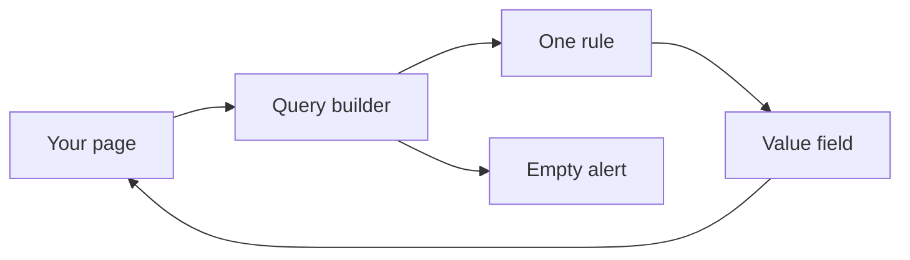
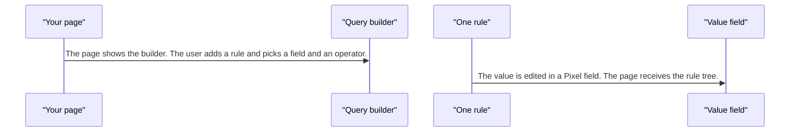
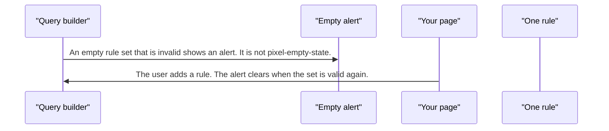

# pixel-query-builder — design

This page explains **pixel-query-builder** in plain language. The exact input and output names live in [README.md](./README.md). This page does not copy that table.

**Walk through every flow:** open [orchestration.html](./orchestration.html) in a browser (serve the `src/lib` folder so the shared player script can load).

## 1. What this does, and what it does not

A form that builds a set of rules: field, operator, and value. The variant is only layout. An empty rule set is a validation alert, not an empty-state illustration. Value editors are normal Pixel fields.

| This piece does | It does not |
| --- | --- |
| Builds a rule tree the page can save | Run the query against a server |
| Uses Pixel inputs for values | Show pixel-empty-state when there are no rules |

## 2. Who talks to whom

## 3. Flows

### Add a rule

1. The page shows the builder. The user adds a rule and picks a field and an operator.
2. The value is edited in a Pixel field. The page receives the rule tree.

### No rules

1. An empty rule set that is invalid shows an alert. It is not pixel-empty-state.
2. The user adds a rule. The alert clears when the set is valid again.

## 4. Step by step

### Add a rule

### No rules

## 5. States

- Has rules, or empty and invalid.
- A rule mid-edit: field chosen, value not filled.
- Disabled when the page locks the builder.

## 6. Easy to get wrong

- The variant changes layout only. It is not a different product.
- Do not replace the empty-rules alert with pixel-empty-state.

## 7. Files

- `_pixel-query-builder-shared.scss`
- `pixel-query-builder-drag-preview.ts`
- `pixel-query-builder-size.ts`
- `pixel-query-builder.html`
- `pixel-query-builder.scss`
- `pixel-query-builder.store.ts`
- `pixel-query-builder.ts`
- `pixel-query-builder.types.ts`
- `pixel-query-builder.utils.ts`
- `pixel-query-builder.validator.ts`
- `pixel-query-group.html`
- `pixel-query-group.scss`
- `pixel-query-group.ts`
- `pixel-query-operator.registry.ts`
- `pixel-query-rule.html`
- `pixel-query-rule.scss`
- `pixel-query-rule.ts`
- `pixel-query-summary.html`
- `pixel-query-summary.scss`
- `pixel-query-summary.ts`
- `pixel-query-summary.utils.ts`
- `pixel-query-value.html`
- `pixel-query-value.scss`
- `pixel-query-value.ts`

The behavior contract stays in [README.md](./README.md). If this page and the README disagree, the README wins. Fix this page.
