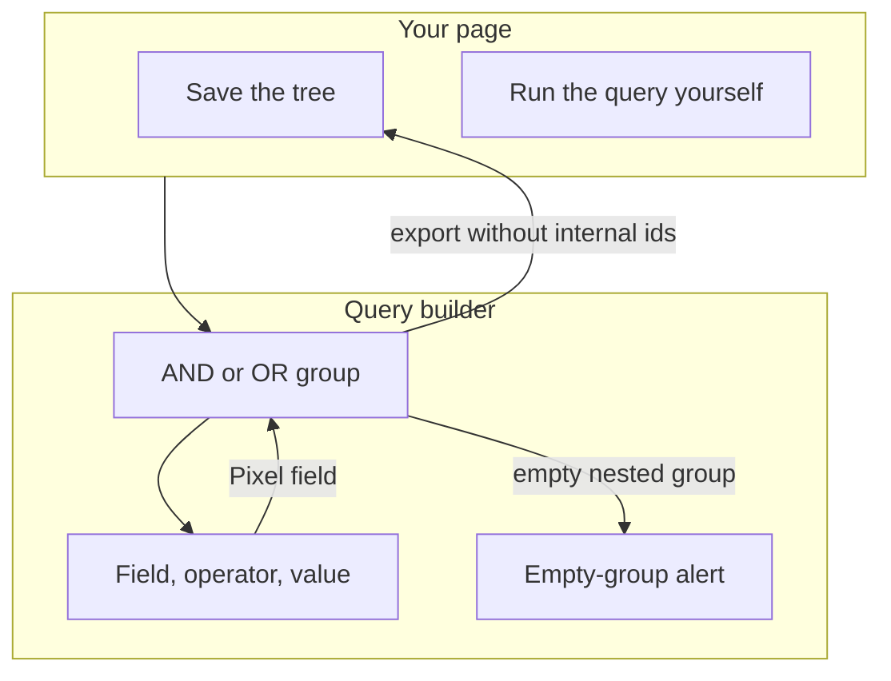
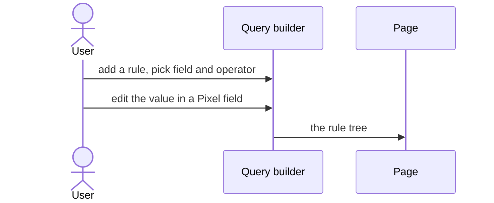
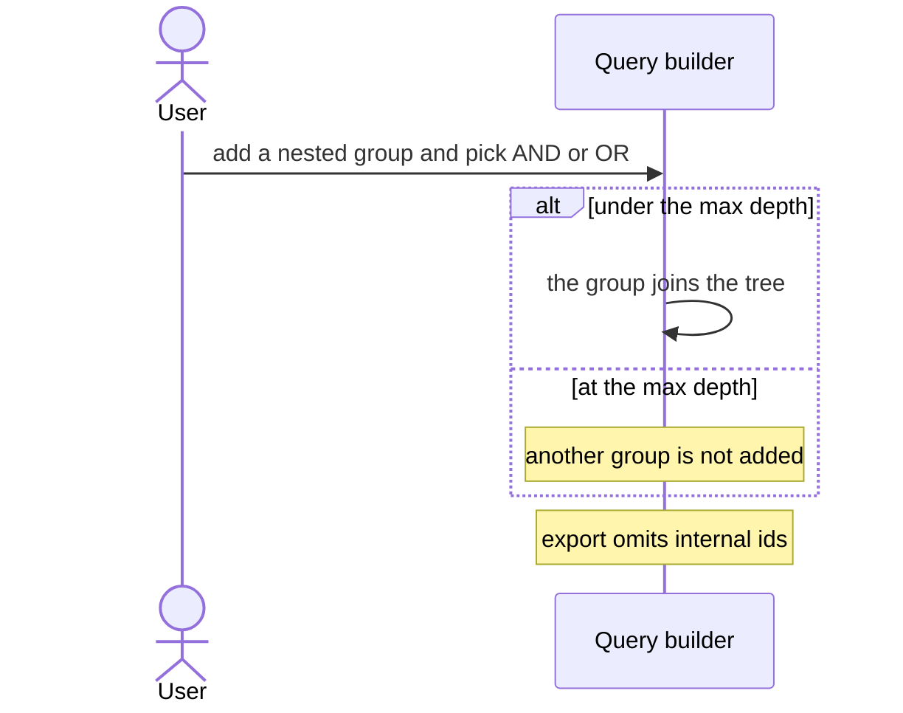
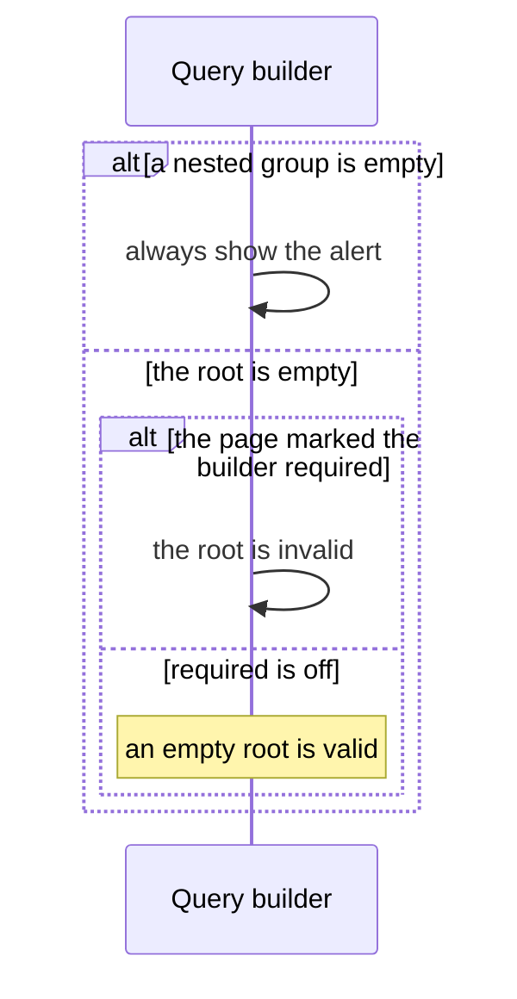

# pixel-query-builder — design

This page explains **pixel-query-builder** in plain language. The exact input and output names live in [README.md](./README.md). This page does not copy that table.

**Walk through every flow:** open [orchestration.html](./orchestration.html) in a browser (serve the `src/lib` folder so the shared player script can load).

## 1. What this does, and what it does not

A form that builds a nested rule tree: field, operator, and value, plus AND/OR groups. The variant is only layout. An empty nested group is a validation alert, not an empty-state illustration. The root may be empty unless the page marks it required. Value editors are normal Pixel fields.

| This piece does | It does not |
| --- | --- |
| Builds a nested rule tree the page can save | Run the query against a server |
| Uses Pixel inputs for values | Show pixel-empty-state when there are no rules |
| Nests AND/OR groups up to the configured depth | Keep group ids in the exported query payload |

## 2. Who talks to whom

The builder edits a nested rule tree. It does not run the query. The page saves the tree and runs it. An empty nested group is always invalid. The root may be empty unless the page marks the builder required. Export drops internal ids.

**How to read the picture**

- **Variant is layout only.** Ruleset, tree, card, and compact are the same tree.
- **Value editors are normal Pixel fields.**
- **Depth.** Nesting stops at the configured max.
- **Empty.** A nested group with no children always shows an alert. That alert is not pixel-empty-state. The root is invalid only when required is on.
- **Export.** Call export when you need the payload. Internal ids stay in the component and are omitted from the payload.

## 3. Flows

### Add a rule

1. The page shows the builder. The user adds a rule and picks a field and an operator.
2. The value is edited in a Pixel field. The page receives the rule tree.

### Nest a group

1. The user adds a nested ruleset and picks AND or OR. Depth stops at the configured max.
2. Rules inside the group join the tree. Export omits internal ids. The page saves the nested shape.

### No rules

1. An empty nested group always shows an alert. It is not pixel-empty-state. The root group is invalid only when the page marks the builder required.
2. The user adds a rule. The alert clears when that group is no longer empty.

## 4. Step by step

Section 3 is the short list. Each picture here is one of those flows, with the branch that changes what the developer must do. Read the note under the picture before copying the pattern.

### Add a rule

The page stores the tree. The builder does not call your API.

### Nest a group

The page should save the nested shape from export, not a private copy of the component’s ids. Those ids are regenerated on import.

### No rules

Do not replace this alert with pixel-empty-state. Incomplete rules, missing a field or a value, are still validated in both modes.

## 5. States

- Root may be empty. A nested group with no children is invalid.
- Nested AND/OR groups within max depth.
- A rule mid-edit: field chosen, value not filled.
- Disabled when the page locks the builder.

## 6. Easy to get wrong

- The variant changes layout only. It is not a different product.
- Do not replace the empty-rules alert with pixel-empty-state.
- Do not put internal node ids into the saved query. Export strips them.

## 7. Files

- `_pixel-query-builder-shared.scss`
- `pixel-query-builder-drag-preview.ts`
- `pixel-query-builder-size.ts`
- `pixel-query-builder.html`
- `pixel-query-builder.scss`
- `pixel-query-builder.store.ts`
- `pixel-query-builder.ts`
- `pixel-query-builder.types.ts`
- `pixel-query-builder.utils.ts`
- `pixel-query-builder.validator.ts`
- `pixel-query-group.html`
- `pixel-query-group.scss`
- `pixel-query-group.ts`
- `pixel-query-operator.registry.ts`
- `pixel-query-rule.html`
- `pixel-query-rule.scss`
- `pixel-query-rule.ts`
- `pixel-query-summary.html`
- `pixel-query-summary.scss`
- `pixel-query-summary.ts`
- `pixel-query-summary.utils.ts`
- `pixel-query-value.html`
- `pixel-query-value.scss`
- `pixel-query-value.ts`

The behavior contract stays in [README.md](./README.md). If this page and the README disagree, the README wins. Fix this page.
