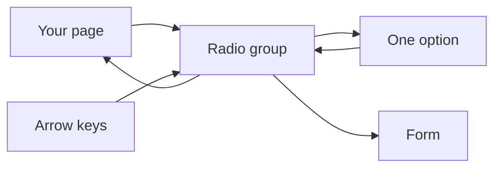
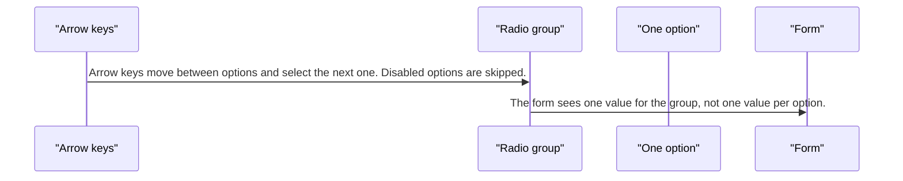
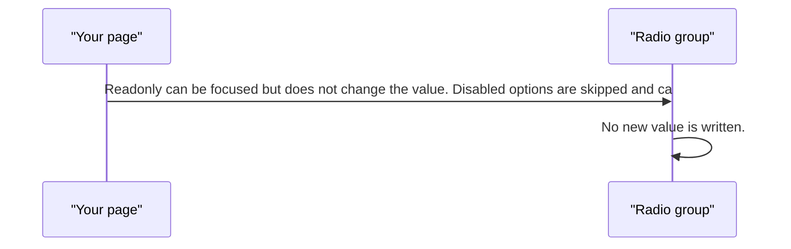

# pixel-radio — design

This page explains **pixel-radio** in plain language. The exact input and output names live in [README.md](./README.md). This page does not copy that table.

**Walk through every flow:** open [orchestration.html](./orchestration.html) in a browser (serve the `src/lib` folder so the shared player script can load).

## 1. What this does, and what it does not

A set of options where one is selected. The group owns the value, the arrow keys, and the form binding. Each radio is an option inside that group.

| This piece does | It does not |
| --- | --- |
| Picks one option in a group | Pick many (use pixel-checkbox) |
| Moves with arrow keys | Change the value while readonly |

## 2. Who talks to whom



## 3. Flows

### Pick one

1. The page lists options and sets the current value on the group.
2. The user clicks an option or presses Space. The group updates the single value.

### Arrow keys

1. Arrow keys move between options and select the next one. Disabled options are skipped.
2. The form sees one value for the group, not one value per option.

### Readonly or disabled

1. Readonly can be focused but does not change the value. Disabled options are skipped and cannot be chosen.
2. No new value is written.

## 4. Step by step

### Pick one

```mermaid
sequenceDiagram
  participant page as "Your page"
  participant group as "Radio group"
  participant option as "One option"
  page->>group: The page lists options and sets the current value on the group.
  option->>group: The user clicks an option or presses Space. The group updates the single value.
```

### Arrow keys



### Readonly or disabled



## 5. States

- None selected, or one selected.
- Disabled option: skipped.
- Readonly group: focusable, no change.
- Error on the group when the form is invalid.

## 6. Easy to get wrong

- Bind the value on the group. A single radio does not own the selection.
- Readonly and disabled are different. Readonly still allows focus.

## 7. Files

- `pixel-radio-group.html`
- `pixel-radio-group.ts`
- `pixel-radio.html`
- `pixel-radio.scss`
- `pixel-radio.shared.ts`
- `pixel-radio.tokens.ts`
- `pixel-radio.ts`

The behavior contract stays in [README.md](./README.md). If this page and the README disagree, the README wins. Fix this page.
