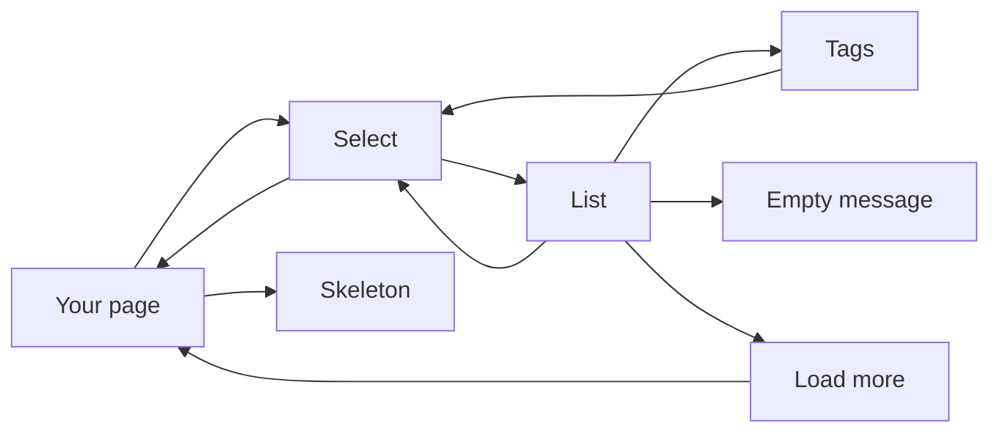
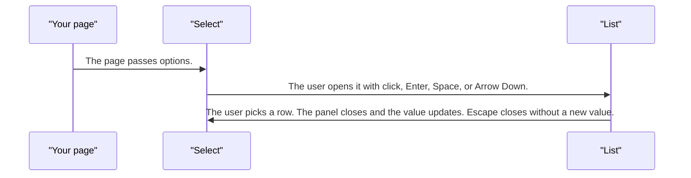
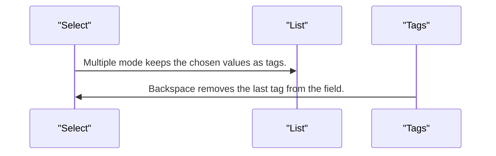
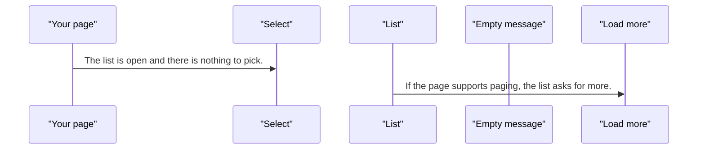
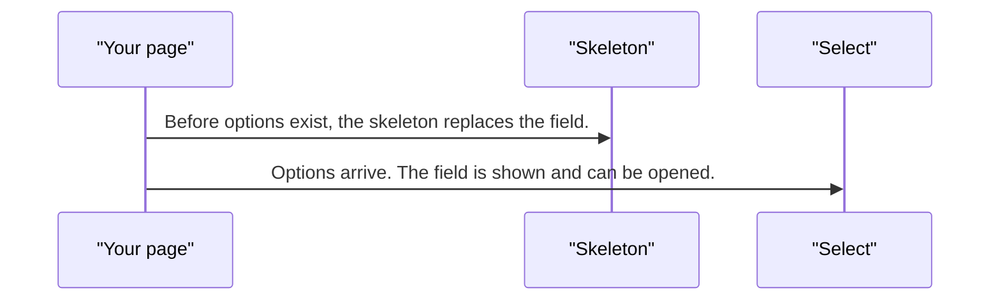

# pixel-select — design

This page explains **pixel-select** in plain language. The exact input and output names live in [README.md](./README.md). This page does not copy that table.

**Walk through every flow:** open [orchestration.html](./orchestration.html) in a browser (serve the `src/lib` folder so the shared player script can load).

## 1. What this does, and what it does not

A closed field that opens a list. One or many options can be chosen. The empty list is a short message inside the panel, not a full empty-state page. Loading more rows is paging, not virtualization.

| This piece does | It does not |
| --- | --- |
| Opens a list and commits a choice | Create a brand-new value (use pixel-autocomplete when you need that) |
| Supports single and multiple | Virtualize the list. Load-more only asks for the next page |

## 2. Who talks to whom

## 3. Flows

### Pick one

1. The page passes options. The field shows the current label or a placeholder.
2. The user opens it with click, Enter, Space, or Arrow Down. Focus moves in the list.
3. The user picks a row. The panel closes and the value updates. Escape closes without a new value.

### Pick many

1. Multiple mode keeps the chosen values as tags. Picking a row toggles it.
2. Backspace removes the last tag from the field. The page receives the new list.

### No options

1. The list is open and there is nothing to pick. A short empty message is shown in the panel.
2. If the page supports paging, the list asks for more. That is not a virtual scroll window.

### Skeleton

1. Before options exist, the skeleton replaces the field.
2. Options arrive. The field is shown and can be opened.

## 4. Step by step

### Pick one

### Pick many

### No options

### Skeleton

## 5. States

- Closed, open, and loading more.
- Single value or tags.
- Empty list: a message in the panel.
- Disabled, readonly, and error from the form.
- Skeleton before the field is ready.

## 6. Easy to get wrong

- The empty panel is not pixel-empty-state. It is a short message in the list.
- Load more is paging. It does not virtualize a huge list.
- Backspace on a multiple field removes a tag. Do not treat that as text editing.

## 7. Files

- `pixel-select.html`
- `pixel-select.scss`
- `pixel-select.ts`

The behavior contract stays in [README.md](./README.md). If this page and the README disagree, the README wins. Fix this page.
