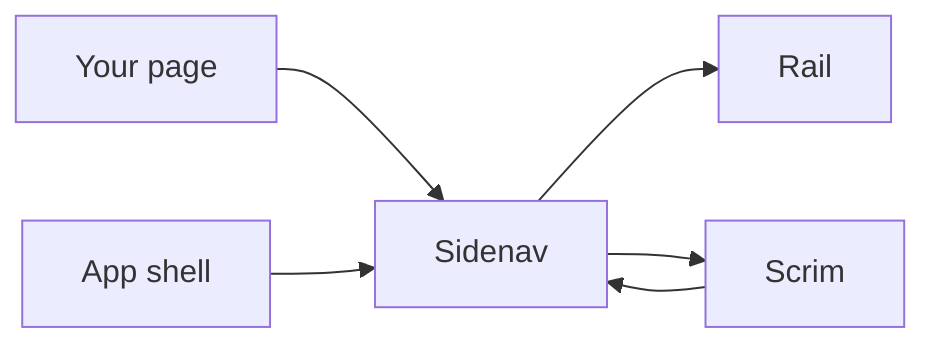
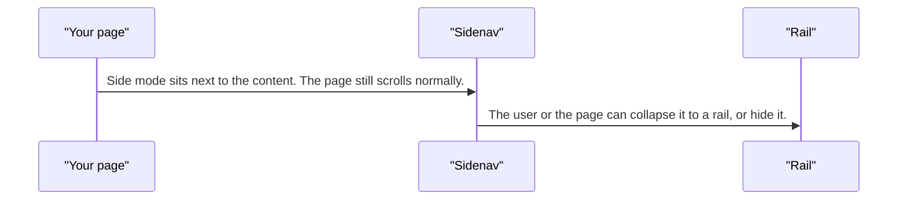
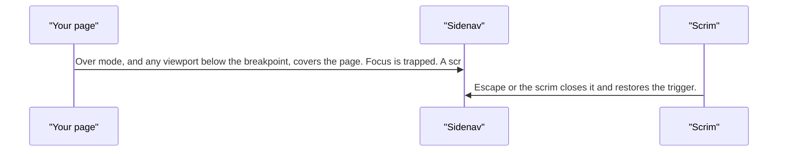
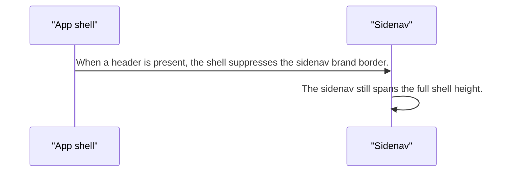

# pixel-sidenav — design

This page explains **pixel-sidenav** in plain language. The exact input and output names live in [README.md](./README.md). This page does not copy that table.

**Walk through every flow:** open [orchestration.html](./orchestration.html) in a browser (serve the `src/lib` folder so the shared player script can load).

## 1. What this does, and what it does not

The side navigation. It can sit beside the page or cover it. Below the breakpoint it is forced to cover. It can collapse to a rail or hide. Cover mode has a scrim, a focus trap, and Escape.

| This piece does | It does not |
| --- | --- |
| Shows navigation beside the page or over it | Replace the router |
| Collapses to a rail or hides | Keep side-by-side mode on a small screen |

## 2. Who talks to whom

## 3. Flows

### Beside the page

1. Side mode sits next to the content. The page still scrolls normally.
2. The user or the page can collapse it to a rail, or hide it.

### Cover the page

1. Over mode, and any viewport below the breakpoint, covers the page. Focus is trapped. A scrim is shown.
2. Escape or the scrim closes it and restores the trigger.

### Inside the shell

1. When a header is present, the shell suppresses the sidenav brand border.
2. The sidenav still spans the full shell height.

## 4. Step by step

### Beside the page

### Cover the page

### Inside the shell

## 5. States

- Side, cover, rail, or hidden.
- Forced cover below the breakpoint.
- Cover: scrim, focus trap, Escape.
- Brand border off inside the shell when a header exists.

## 6. Easy to get wrong

- Do not expect side-by-side layout on a small screen. It becomes a cover.
- Put the actual navigation landmark in the sidenav content. The shell does not add a nav for you.

## 7. Files

- `pixel-sidenav.html`
- `pixel-sidenav.scss`
- `pixel-sidenav.ts`

The behavior contract stays in [README.md](./README.md). If this page and the README disagree, the README wins. Fix this page.
