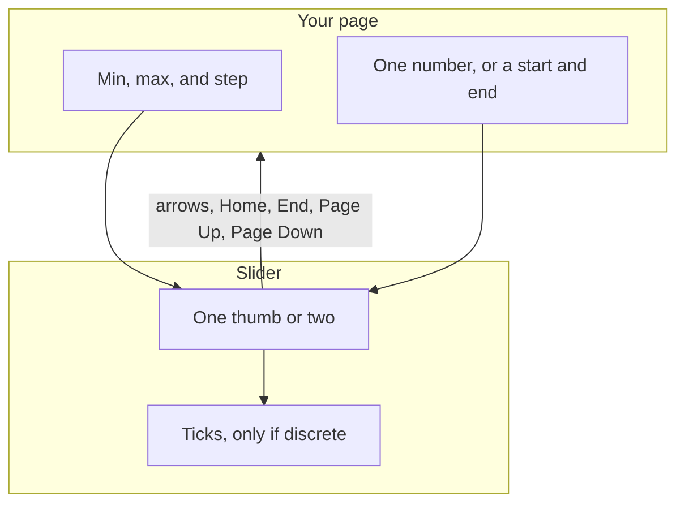
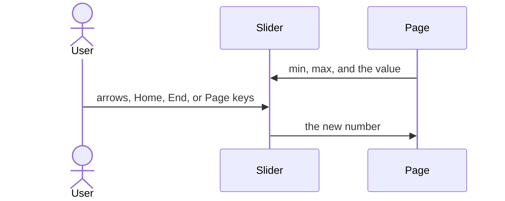
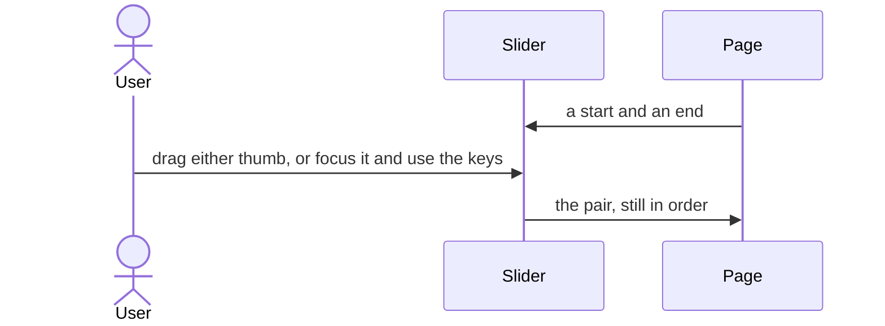
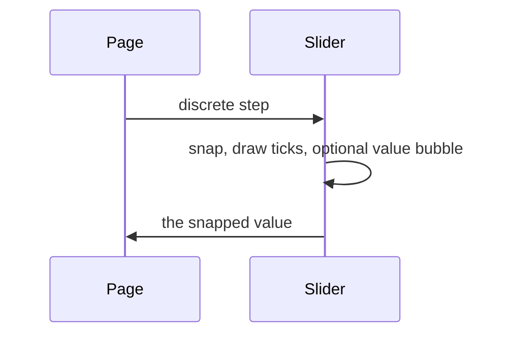

# pixel-slider — design

This page explains **pixel-slider** in plain language. The exact input and output names live in [README.md](./README.md). This page does not copy that table.

**Walk through every flow:** open [orchestration.html](./orchestration.html) in a browser (serve the `src/lib` folder so the shared player script can load).

## 1. What this does, and what it does not

A slider on a native range input, so keyboard and screen readers work. One thumb is a single value. Two thumbs are a start and end. Discrete mode snaps to steps and shows ticks.

| This piece does | It does not |
| --- | --- |
| Sets a number, or a start and end | Type a free-form date (use a date picker) |
| Moves with arrows, Home, End, and Page Up or Down | Hide the native input. The native input is the control |

## 2. Who talks to whom

The slider is a native range input, so the keyboard and screen readers already work. One thumb is a number. Two thumbs are a start and an end. Discrete mode snaps to the step and can show ticks.

**How to read the picture**

- **Do not rebuild the keys on a div.** The native input is the control.
- **One value.** Arrows move one step. Home and End jump to the ends. Page Up and Page Down take a larger step.
- **Range.** The value is a pair. The two thumbs stay in order.
- **Discrete.** The form receives the snapped number, or the snapped pair.

## 3. Flows

### One value

1. The page sets min, max, and the current value. The thumb sits on that value.
2. Arrows nudge by one step. Home and End jump to the ends. Page Up and Page Down take a larger step.

### Start and end

1. Range mode has two thumbs. The value is a start and an end.
2. The user drags either thumb, or focuses it and uses the keys. The two values stay in order.

### Steps and ticks

1. Discrete mode snaps to the step and draws ticks. A bubble can show the value.
2. The form receives the snapped number, or the snapped pair in range mode.

## 4. Step by step

Section 3 is the short list. Each picture here is one of those flows, with the branch that changes what the developer must do. Read the note under the picture before copying the pattern.

### One value

Bind a single number. Do not bind a pair unless range mode is on.

### Start and end

Range mode is a tuple. The start does not pass the end.

### Steps and ticks

The bubble is a display of the snapped value. The form value is the number, not the bubble text.

## 5. States

- Single thumb or two thumbs.
- Dragging, keyboard focus on a thumb, disabled.
- Discrete: snapped value, ticks, and an optional value bubble.
- Invalid when the form validator fails.

## 6. Easy to get wrong

- The slider is a native range input with role slider. Do not rebuild keyboard behavior on a div.
- Range mode is a pair. Do not bind a single number to it.

## 7. Files

- `pixel-slider.html`
- `pixel-slider.scss`
- `pixel-slider.ts`

The behavior contract stays in [README.md](./README.md). If this page and the README disagree, the README wins. Fix this page.
