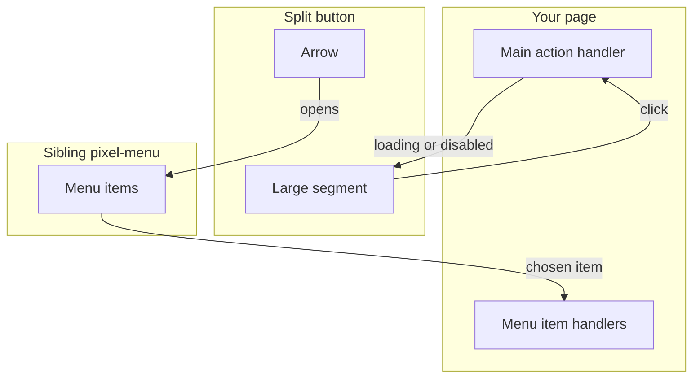
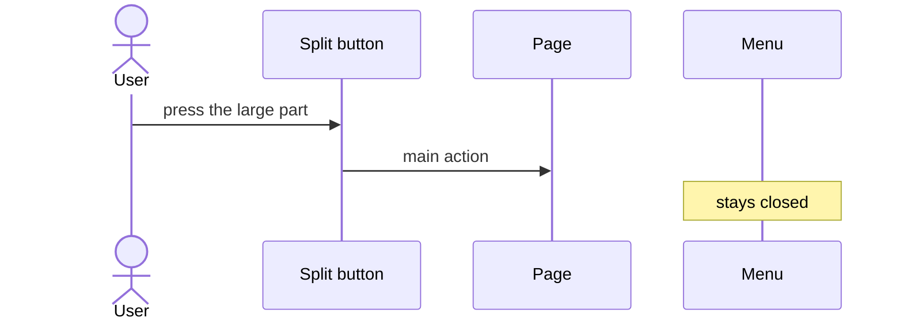
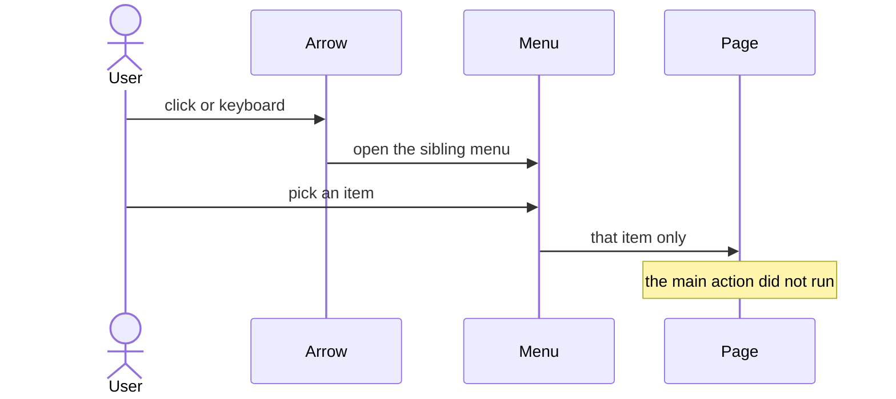
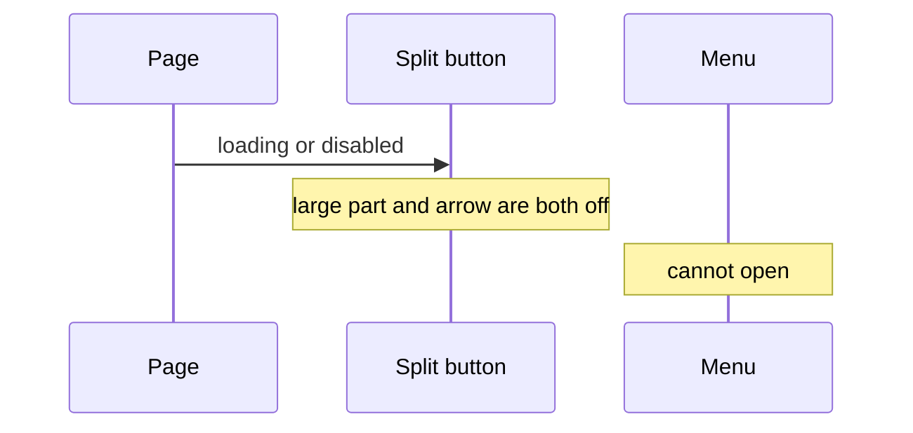

# pixel-split-button — design

This page explains **pixel-split-button** in plain language. The exact input and output names live in [README.md](./README.md). This page does not copy that table.

**Walk through every flow:** open [orchestration.html](./orchestration.html) in a browser (serve the `src/lib` folder so the shared player script can load).

## 1. What this does, and what it does not

One control with two parts: the main action, and a small arrow that opens a menu. The menu is a sibling pixel-menu. The arrow does not run the main action.

| This piece does | It does not |
| --- | --- |
| Runs the main action from the large part | Put the menu items inside the button |
| Opens the menu from the arrow | Run the main action when the arrow is pressed |

## 2. Who talks to whom

One control, two jobs. The large part runs the main action. The arrow only opens a sibling menu. The menu is not inside the button.

**How to read the picture**

- **Large segment → page.** That click is the main action. The menu stays closed.
- **Arrow → menu.** The arrow does not emit the main action. Place pixel-menu as a sibling and point the split button at it.
- **Loading or disabled → both parts.** Neither the action nor the menu can run until the page clears that state.

## 3. Flows

### Main action

1. The page sets the main label. The large part is the action.
2. The user clicks the large part. The page runs that action. The menu stays closed.

### Open the menu

1. The user clicks the arrow, or uses the keyboard on it. The sibling menu opens.
2. The user picks an item. The page handles that item. The main action does not run.

### Loading or disabled

1. Loading or disabled turns off both parts.
2. The user cannot run the action or open the menu until the page clears that state.

## 4. Step by step

Section 3 is the short list. Each picture here is one of those flows, with the branch that changes what the developer must do. Read the note under the picture before copying the pattern.

### Main action

Put the primary label on the large part. Do not expect the arrow click to run the same action.

### Open the menu

The menu lives beside the split button, not inside it. Closing the menu does not activate the large segment.

### Loading or disabled

Do not disable only the large part. A user could still open the menu and run a second action while the main work is busy.

## 5. States

- Default: both parts ready.
- Menu open: the arrow has expanded the menu.
- Loading or disabled: both the main part and the arrow are off.

## 6. Easy to get wrong

- Do not put pixel-menu inside the button. Place it as a sibling and point the split button at it.
- Do not expect the arrow click to emit the main action.

## 7. Files

- `pixel-split-button.html`
- `pixel-split-button.scss`
- `pixel-split-button.ts`

The behavior contract stays in [README.md](./README.md). If this page and the README disagree, the README wins. Fix this page.
