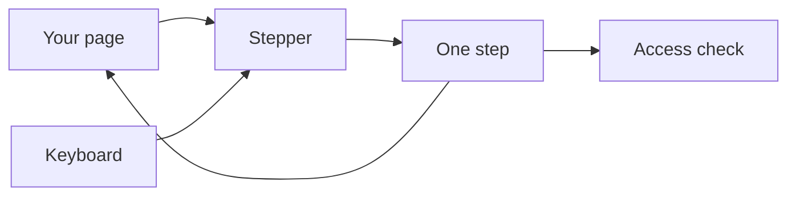
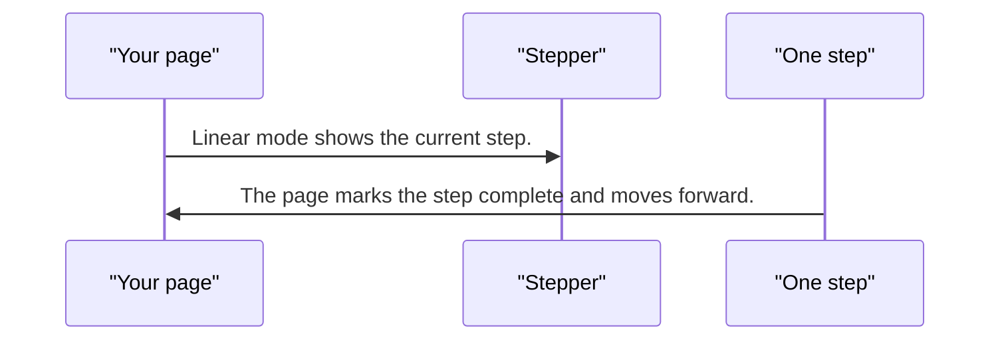
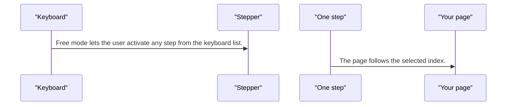
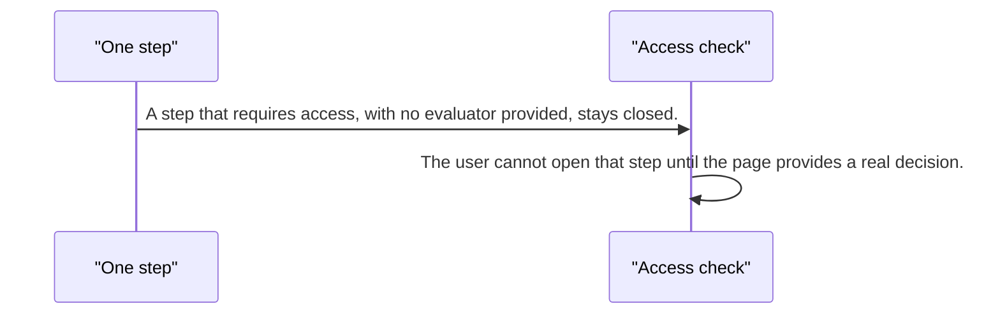

# pixel-stepper — design

This page explains **pixel-stepper** in plain language. The exact input and output names live in [README.md](./README.md). This page does not copy that table.

**Walk through every flow:** open [orchestration.html](./orchestration.html) in a browser (serve the `src/lib` folder so the shared player script can load).

## 1. What this does, and what it does not

A sequence of steps. Linear mode blocks later steps until earlier ones are done. Free mode lets the user jump. If an access check is required and none is provided, the step stays closed. The chrome does not have a skeleton mode.

| This piece does | It does not |
| --- | --- |
| Moves through steps in order or freely | Show a skeleton for the step chrome |
| Fails closed when access is required but missing | Treat orientation as a color. It is only layout |

## 2. Who talks to whom

## 3. Flows

### In order

1. Linear mode shows the current step. Later steps are not available yet.
2. The page marks the step complete and moves forward. The user cannot skip ahead.

### Jump around

1. Free mode lets the user activate any step from the keyboard list.
2. The page follows the selected index. Labels can collapse automatically when space is tight.

### Access missing

1. A step that requires access, with no evaluator provided, stays closed.
2. The user cannot open that step until the page provides a real decision.

## 4. Step by step

### In order

### Jump around

### Access missing

## 5. States

- Current, complete, and upcoming.
- Linear lock on later steps.
- Free selection.
- Access fail-closed.

## 6. Easy to get wrong

- Orientation and type change layout, not the color set.
- There is no skeleton for the stepper chrome.
- A missing access evaluator does not mean "allow". It means the step stays shut.

## 7. Files

- `pixel-step-actions.ts`
- `pixel-step-content.ts`
- `pixel-step-header.html`
- `pixel-step-header.scss`
- `pixel-step-header.ts`
- `pixel-step-icon.ts`
- `pixel-step.ts`
- `pixel-stepper.html`
- `pixel-stepper.scss`
- `pixel-stepper.ts`
- `pixel-stepper.types.ts`

The behavior contract stays in [README.md](./README.md). If this page and the README disagree, the README wins. Fix this page.
