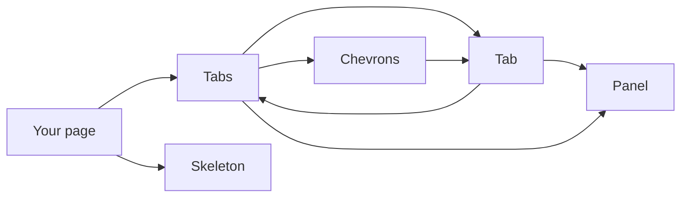
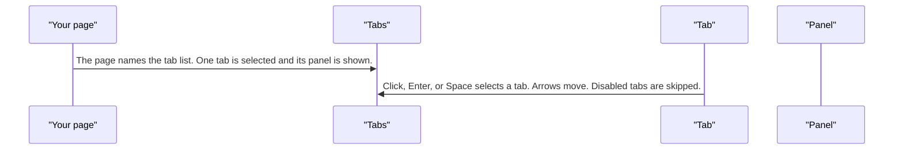
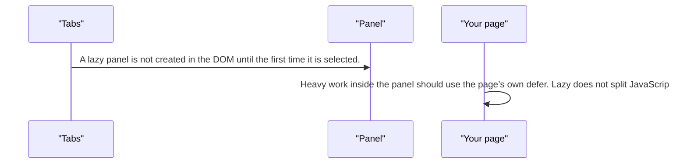
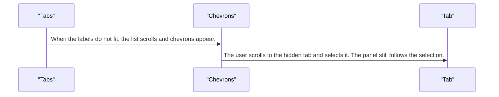
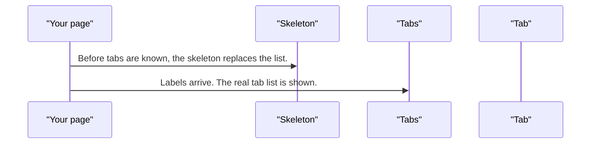

# pixel-tabs — design

This page explains **pixel-tabs** in plain language. The exact input and output names live in [README.md](./README.md). This page does not copy that table.

**Walk through every flow:** open [orchestration.html](./orchestration.html) in a browser (serve the `src/lib` folder so the shared player script can load).

## 1. What this does, and what it does not

A tab list and panels. Arrow keys move, Home and End jump, and disabled tabs are skipped. The tab list needs an accessible name. Lazy panels skip creating the DOM until the tab is chosen. They do not skip loading scripts.

| This piece does | It does not |
| --- | --- |
| Shows one panel at a time | Lazy-load JavaScript. Lazy only skips creating the panel DOM |
| Scrolls the tab list when it overflows | Leave the tab list unnamed |

## 2. Who talks to whom

## 3. Flows

### Select a tab

1. The page names the tab list. One tab is selected and its panel is shown.
2. Click, Enter, or Space selects a tab. Arrows move. Disabled tabs are skipped.

### Lazy panel

1. A lazy panel is not created in the DOM until the first time it is selected.
2. Heavy work inside the panel should use the page’s own defer. Lazy does not split JavaScript.

### Too many tabs

1. When the labels do not fit, the list scrolls and chevrons appear.
2. The user scrolls to the hidden tab and selects it. The panel still follows the selection.

### Skeleton

1. Before tabs are known, the skeleton replaces the list.
2. Labels arrive. The real tab list is shown.

## 4. Step by step

### Select a tab

### Lazy panel

### Too many tabs

### Skeleton

## 5. States

- One selected tab, the rest unselected.
- Disabled tab: skipped by the keyboard.
- Overflow: scroll and chevrons.
- Lazy panel: not in the DOM until selected.
- Skeleton while loading.

## 6. Easy to get wrong

- Give the tab list an accessible name. It is required.
- Lazy skips DOM creation, not code loading.
- Do not put a tab panel’s only content behind a control the user cannot reach.

## 7. Files

- `_tabs-styles.scss`
- `pixel-tab-label.ts`
- `pixel-tab-link.scss`
- `pixel-tab-link.ts`
- `pixel-tab-nav.scss`
- `pixel-tab-nav.token.ts`
- `pixel-tab-nav.ts`
- `pixel-tab.ts`
- `pixel-tabs.scss`
- `pixel-tabs.ts`

The behavior contract stays in [README.md](./README.md). If this page and the README disagree, the README wins. Fix this page.
