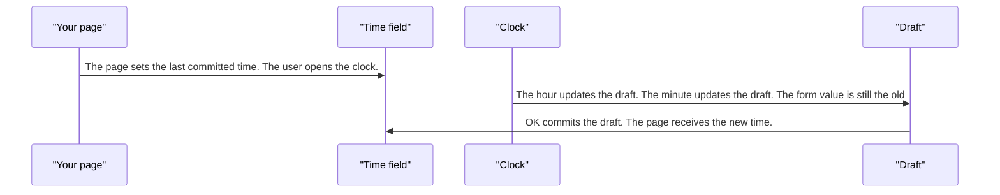
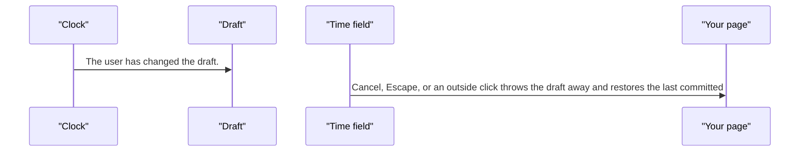

# pixel-timepicker — design

This page explains **pixel-timepicker** in plain language. The exact input and output names live in [README.md](./README.md). This page does not copy that table.

**Walk through every flow:** open [orchestration.html](./orchestration.html) in a browser (serve the `src/lib` folder so the shared player script can load).

## 1. What this does, and what it does not

A time control with a clock. Choosing an hour, then a minute, updates a draft only. OK commits. Cancel, Escape, or a click outside restores the last committed time.

| This piece does | It does not |
| --- | --- |
| Picks a time and commits on OK | Commit the hour before the minute is chosen |
| Restores the last time on cancel | Write the draft into the form on every tick |

## 2. Who talks to whom

## 3. Flows

### Pick a time

1. The page sets the last committed time. The user opens the clock.
2. The hour updates the draft. The minute updates the draft. The form value is still the old time.
3. OK commits the draft. The page receives the new time.

### Cancel

1. The user has changed the draft.
2. Cancel, Escape, or an outside click throws the draft away and restores the last committed time.

## 4. Step by step

### Pick a time

### Cancel

## 5. States

- Closed with a committed time.
- Open on the hour, then on the minute.
- Draft dirty, then committed or restored.

## 6. Easy to get wrong

- Do not write the form value when the hour is picked. Wait for OK.
- Cancel must restore the previous time, not leave the draft in place.

## 7. Files

- `pixel-clock-dial.html`
- `pixel-clock-dial.scss`
- `pixel-clock-dial.ts`
- `pixel-timepicker.html`
- `pixel-timepicker.scss`
- `pixel-timepicker.ts`
- `pixel-timepicker.types.ts`

The behavior contract stays in [README.md](./README.md). If this page and the README disagree, the README wins. Fix this page.
