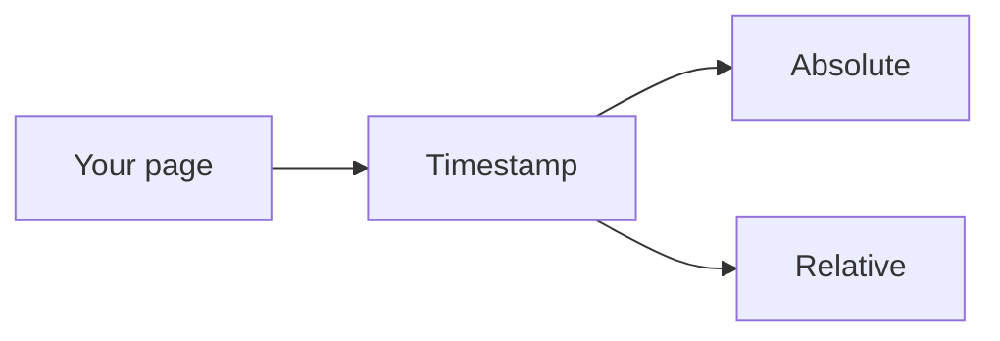
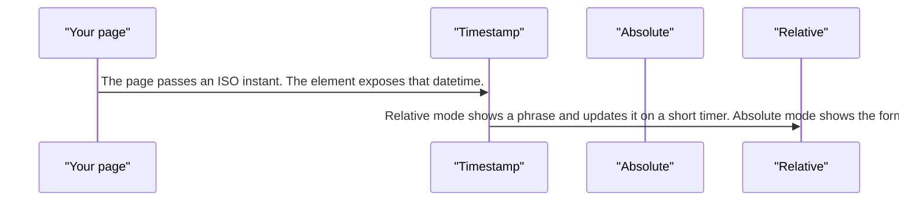
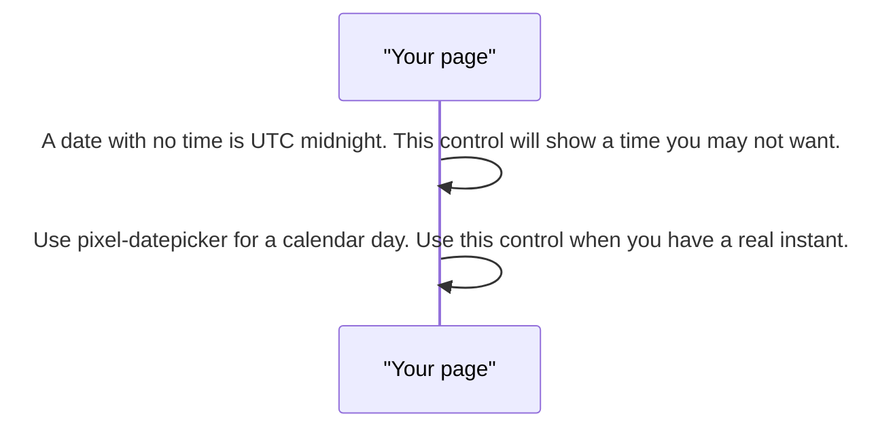

# pixel-timestamp — design

This page explains **pixel-timestamp** in plain language. The exact input and output names live in [README.md](./README.md). This page does not copy that table.

**Walk through every flow:** open [orchestration.html](./orchestration.html) in a browser (serve the `src/lib` folder so the shared player script can load).

## 1. What this does, and what it does not

Shows a moment as a time element with an ISO datetime. Relative text such as "5 minutes ago" refreshes about every 30 seconds. A date-only string is UTC midnight, so use a date picker for dates that have no time.

| This piece does | It does not |
| --- | --- |
| Renders one instant for people and for machines | Edit a date |
| Refreshes relative text | Treat a date-only value as a local calendar day |

## 2. Who talks to whom

## 3. Flows

### Show a time

1. The page passes an ISO instant. The element exposes that datetime.
2. Relative mode shows a phrase and updates it on a short timer. Absolute mode shows the formatted clock time instead.

### Date only

1. A date with no time is UTC midnight. This control will show a time you may not want.
2. Use pixel-datepicker for a calendar day. Use this control when you have a real instant.

## 4. Step by step

### Show a time

### Date only

## 5. States

- Absolute formatted time.
- Relative text that refreshes.
- Invalid or empty when the page passes nothing usable.

## 6. Easy to get wrong

- Do not pass a date-only string if you mean a calendar day. It is read as UTC midnight.
- This is not an editor.

## 7. Files

- `pixel-timestamp.scss`
- `pixel-timestamp.ts`

The behavior contract stays in [README.md](./README.md). If this page and the README disagree, the README wins. Fix this page.
