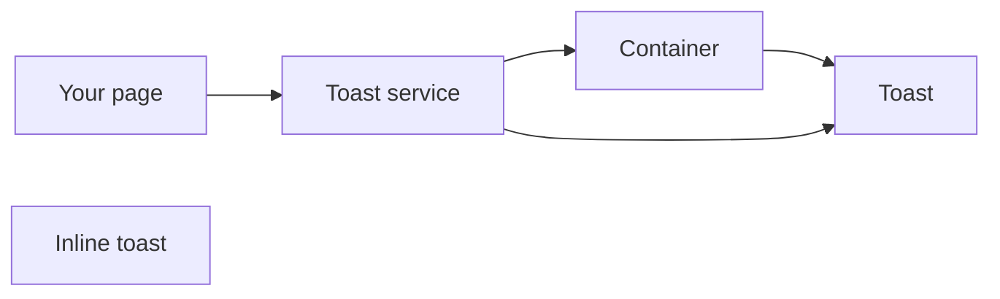
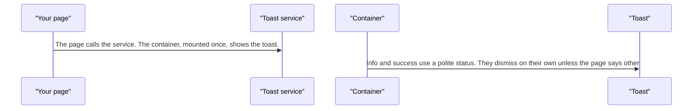
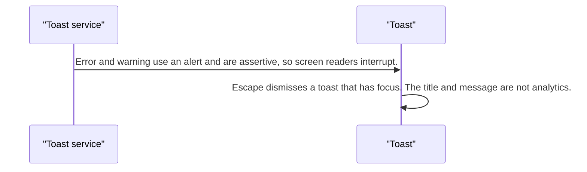
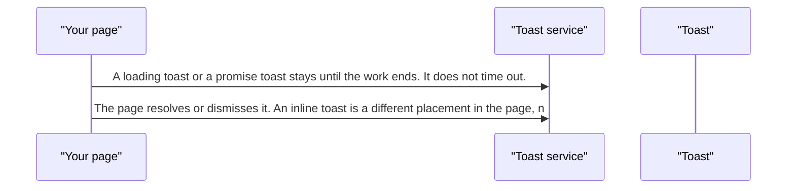

# pixel-toast — design

This page explains **pixel-toast** in plain language. The exact input and output names live in [README.md](./README.md). This page does not copy that table.

**Walk through every flow:** open [orchestration.html](./orchestration.html) in a browser (serve the `src/lib` folder so the shared player script can load).

## 1. What this does, and what it does not

A short message that stacks on the screen. Mount the container once. The service queues toasts. Loading and promise toasts stay until the page closes them. Error and warning are assertive. The title and message are never sent to analytics.

| This piece does | It does not |
| --- | --- |
| Shows a temporary message | Save the message in the notification inbox |
| Queues several toasts | Auto-dismiss a loading toast |

## 2. Who talks to whom

## 3. Flows

### Show a toast

1. The page calls the service. The container, mounted once, shows the toast.
2. Info and success use a polite status. They dismiss on their own unless the page says otherwise.

### Error or warning

1. Error and warning use an alert and are assertive, so screen readers interrupt.
2. Escape dismisses a toast that has focus. The title and message are not analytics.

### Loading

1. A loading toast or a promise toast stays until the work ends. It does not time out.
2. The page resolves or dismisses it. An inline toast is a different placement in the page, not the corner stack.

## 4. Step by step

### Show a toast

### Error or warning

### Loading

## 5. States

- Queued, visible, and dismissed.
- Info or success: polite.
- Error or warning: assertive alert.
- Loading or promise: stays until the page ends it.

## 6. Easy to get wrong

- Mount pixel-toast-container once. A second container fights the queue.
- Do not expect a loading toast to vanish on a timer.
- Do not put toast text in analytics.

## 7. Files

- `pixel-toast-container.html`
- `pixel-toast-container.scss`
- `pixel-toast-container.ts`
- `pixel-toast-inline.html`
- `pixel-toast-inline.scss`
- `pixel-toast-inline.ts`
- `pixel-toast.defaults.ts`
- `pixel-toast.html`
- `pixel-toast.scss`
- `pixel-toast.service.ts`
- `pixel-toast.ts`
- `pixel-toast.types.ts`

The behavior contract stays in [README.md](./README.md). If this page and the README disagree, the README wins. Fix this page.
