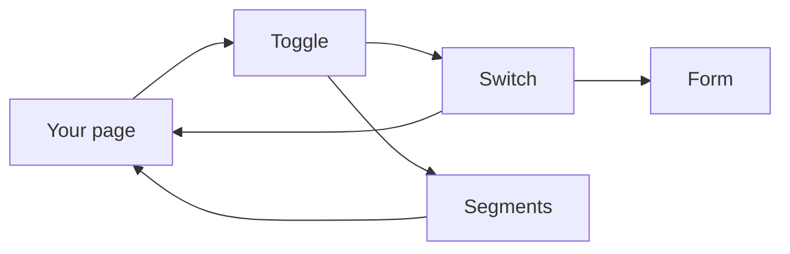
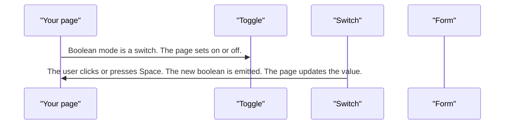
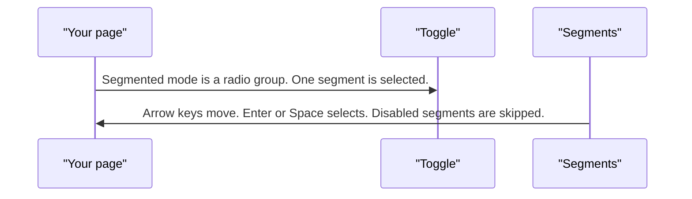

# pixel-toggle — design

This page explains **pixel-toggle** in plain language. The exact input and output names live in [README.md](./README.md). This page does not copy that table.

**Walk through every flow:** open [orchestration.html](./orchestration.html) in a browser (serve the `src/lib` folder so the shared player script can load).

## 1. What this does, and what it does not

Either a boolean switch, or a segmented control where one segment is chosen. The switch is on or off. The segmented control is a radio group. Both work with forms.

| This piece does | It does not |
| --- | --- |
| Switches on or off, or picks one segment | Pick several segments at once |
| Uses arrow keys on segments | Save the value inside the control when the page wants to own it |

## 2. Who talks to whom

## 3. Flows

### Switch

1. Boolean mode is a switch. The page sets on or off.
2. The user clicks or presses Space. The new boolean is emitted. The page updates the value.

### Segments

1. Segmented mode is a radio group. One segment is selected.
2. Arrow keys move. Enter or Space selects. Disabled segments are skipped.

## 4. Step by step

### Switch

### Segments

## 5. States

- Switch: off or on, plus disabled and readonly.
- Segments: one selected, keyboard focus on the active segment.
- Error when the form says the control is invalid.

## 6. Easy to get wrong

- A switch is not a radio group. Segments are not several independent switches.
- Keep the value on the page or the form. Update it from the change event.

## 7. Files

- `pixel-toggle-checked-icon.ts`
- `pixel-toggle-thumb-icon.scss`
- `pixel-toggle-thumb-icon.ts`
- `pixel-toggle-unchecked-icon.ts`
- `pixel-toggle.html`
- `pixel-toggle.scss`
- `pixel-toggle.ts`
- `pixel-toggle.types.ts`

The behavior contract stays in [README.md](./README.md). If this page and the README disagree, the README wins. Fix this page.
