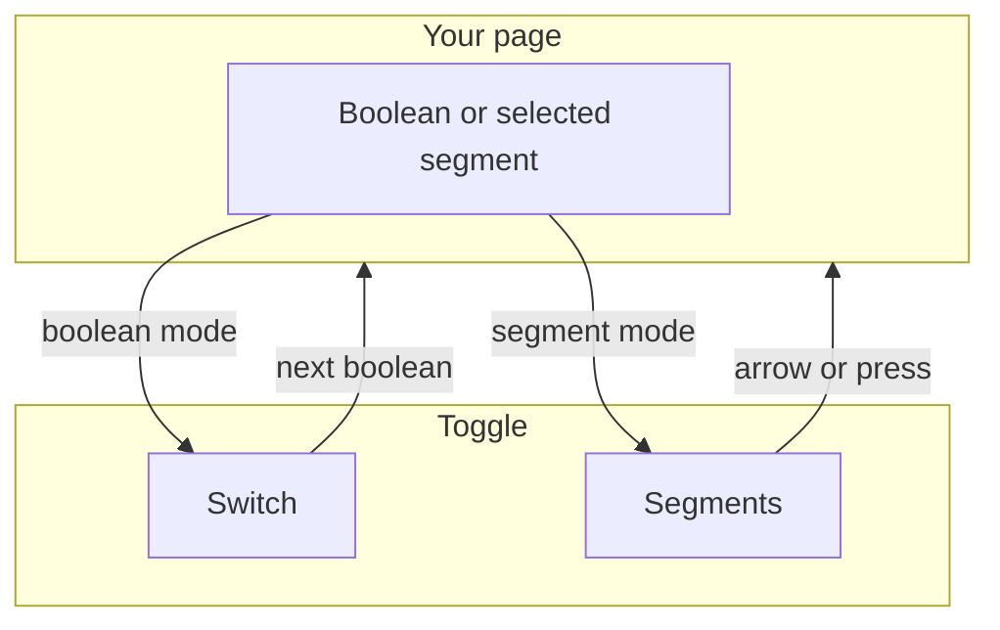
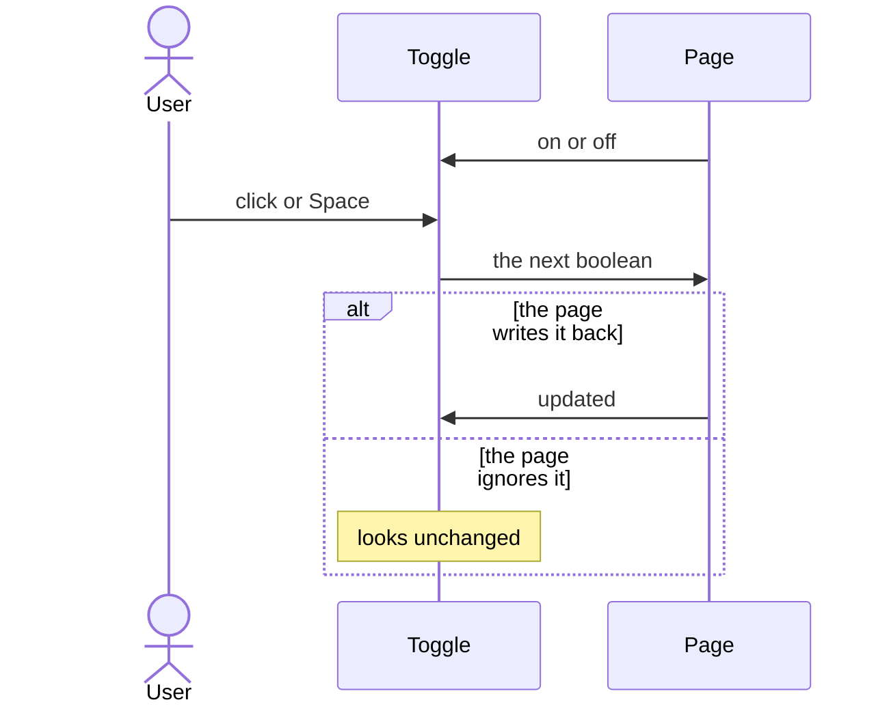
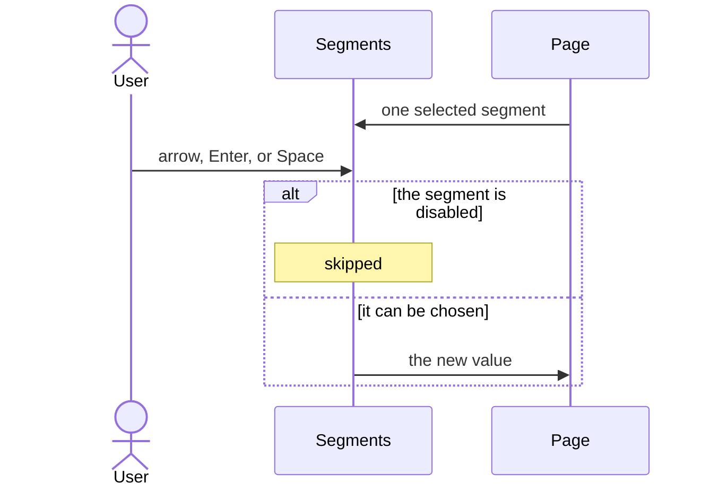

# pixel-toggle — design

This page explains **pixel-toggle** in plain language. The exact input and output names live in [README.md](./README.md). This page does not copy that table.

**Walk through every flow:** open [orchestration.html](./orchestration.html) in a browser (serve the `src/lib` folder so the shared player script can load).

## 1. What this does, and what it does not

Either a boolean switch, or a segmented control where one segment is chosen. The switch is on or off. The segmented control is a radio group. Both work with forms.

| This piece does | It does not |
| --- | --- |
| Switches on or off, or picks one segment | Pick several segments at once |
| Uses arrow keys on segments | Save the value inside the control when the page wants to own it |

## 2. Who talks to whom

A switch is one boolean. Segments are a radio group: one segment is chosen. The page or the form owns the value. The control emits the next value and does not store it.

**How to read the picture**

- **Switch.** Click or Space flips the boolean. It is not a radio group.
- **Segments.** Arrow keys move. Disabled segments are skipped. One segment is selected.
- **Write the value back.** If the page ignores the event, the control stays as it was.

## 3. Flows

### Switch

1. Boolean mode is a switch. The page sets on or off.
2. The user clicks or presses Space. The new boolean is emitted. The page updates the value.

### Segments

1. Segmented mode is a radio group. One segment is selected.
2. Arrow keys move. Enter or Space selects. Disabled segments are skipped.

## 4. Step by step

Section 3 is the short list. Each picture here is one of those flows, with the branch that changes what the developer must do. Read the note under the picture before copying the pattern.

### Switch

Use a switch for a single on or off. Do not use it to pick one of several labels. That is the segmented control.

### Segments

Segments are one choice, like radios. They are not several independent switches.

## 5. States

- Switch: off or on, plus disabled and readonly.
- Segments: one selected, keyboard focus on the active segment.
- Error when the form says the control is invalid.

## 6. Easy to get wrong

- A switch is not a radio group. Segments are not several independent switches.
- Keep the value on the page or the form. Update it from the change event.

## 7. Files

- `pixel-toggle-checked-icon.ts`
- `pixel-toggle-thumb-icon.scss`
- `pixel-toggle-thumb-icon.ts`
- `pixel-toggle-unchecked-icon.ts`
- `pixel-toggle.html`
- `pixel-toggle.scss`
- `pixel-toggle.ts`
- `pixel-toggle.types.ts`

The behavior contract stays in [README.md](./README.md). If this page and the README disagree, the README wins. Fix this page.
