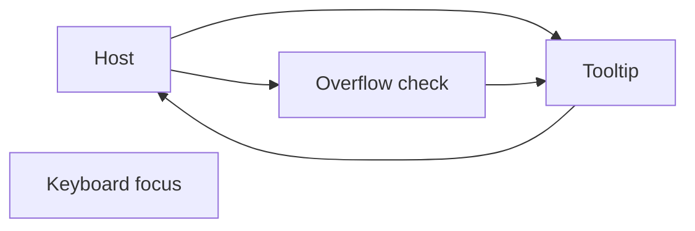
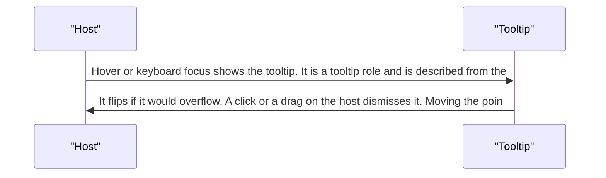
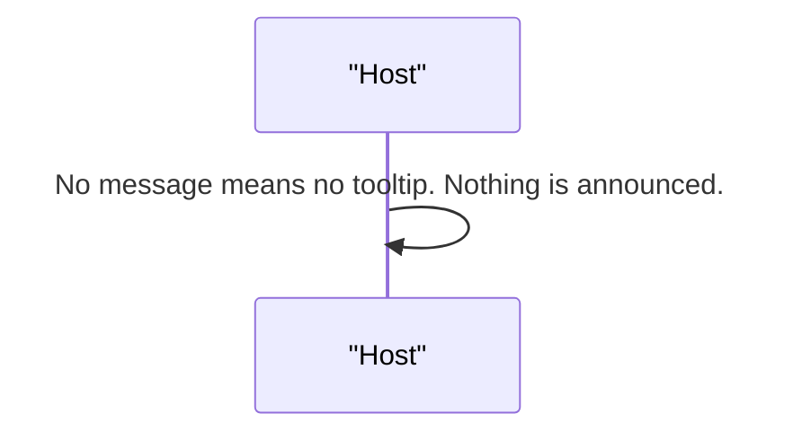
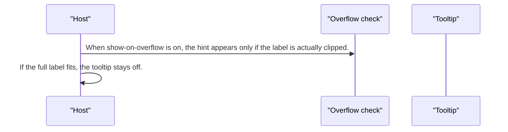

# pixel-tooltip — design

This page explains **pixel-tooltip** in plain language. The exact input and output names live in [README.md](./README.md). This page does not copy that table.

**Walk through every flow:** open [orchestration.html](./orchestration.html) in a browser (serve the `src/lib` folder so the shared player script can load).

## 1. What this does, and what it does not

A short hint on hover or keyboard focus. An empty message turns the tooltip off. It flips when it would overflow the screen. It hides if the user clicks or drags the host. It can also show only when the label is cut off.

| This piece does | It does not |
| --- | --- |
| Shows a hint and points at it with aria-describedby | Stay open after a click on the host |
| Flips to stay on screen | Show when the message is empty |

## 2. Who talks to whom

## 3. Flows

### Show and hide

1. Hover or keyboard focus shows the tooltip. It is a tooltip role and is described from the host.
2. It flips if it would overflow. A click or a drag on the host dismisses it. Moving the pointer away hides it too.

### Empty message

1. No message means no tooltip. Nothing is announced.

### Only when clipped

1. When show-on-overflow is on, the hint appears only if the label is actually clipped.
2. If the full label fits, the tooltip stays off.

## 4. Step by step

### Show and hide

### Empty message

### Only when clipped

## 5. States

- Hidden.
- Visible on hover or keyboard focus.
- Flipped to fit.
- Suppressed when the message is empty, or when the label is not clipped.

## 6. Easy to get wrong

- Do not use a tooltip as the only name of an icon button. Give the button its own label.
- Empty text disables the tooltip. Do not leave a blank bubble.

## 7. Files

- `pixel-tooltip.ts`

The behavior contract stays in [README.md](./README.md). If this page and the README disagree, the README wins. Fix this page.
