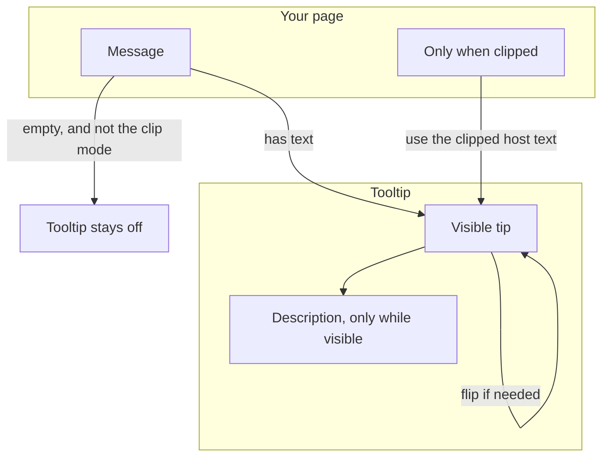
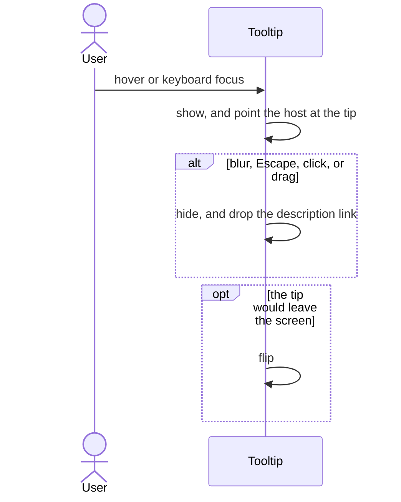
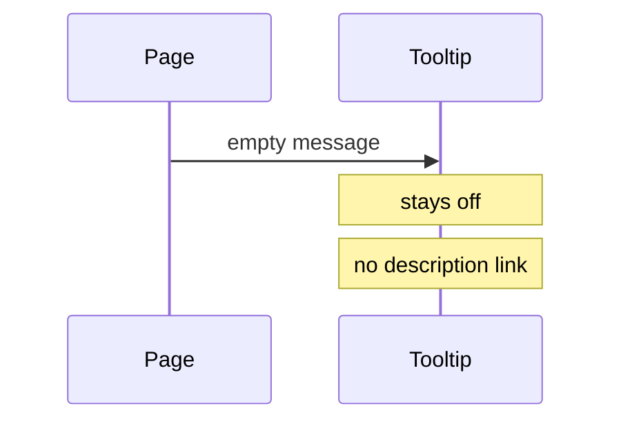
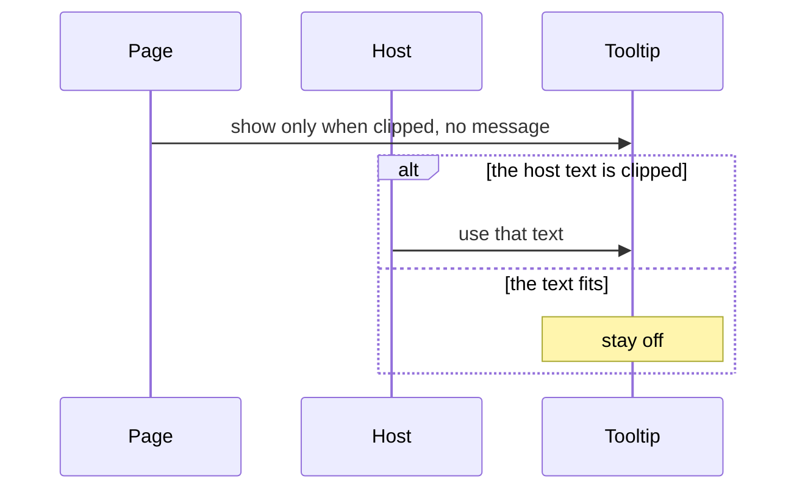

# pixel-tooltip — design

This page explains **pixel-tooltip** in plain language. The exact input and output names live in [README.md](./README.md). This page does not copy that table.

**Walk through every flow:** open [orchestration.html](./orchestration.html) in a browser (serve the `src/lib` folder so the shared player script can load).

## 1. What this does, and what it does not

A short hint on hover or keyboard focus. An empty message turns the tooltip off. It flips when it would overflow the screen. It hides if the user clicks or drags the host. It can also show only when the label is cut off.

| This piece does | It does not |
| --- | --- |
| Shows a hint and points at it with aria-describedby | Stay open after a click on the host |
| Flips to stay on screen | Show when the message is empty |

## 2. Who talks to whom

A tooltip is a hint, not a second label. An empty message turns it off, unless the page asked to show it only when the host text is clipped. The description is exposed only while the tip is visible. Click or drag dismisses it. It flips if it would overflow the screen.

**How to read the picture**

- **Empty message disables the tooltip.** The exception is overflow mode, which uses the clipped host text.
- **Show.** Hover or keyboard focus. Hide on blur, Escape, click, or drag.
- **aria-describedby** exists only while the tip is visible. Do not leave it on a hidden tip.

## 3. Flows

### Show and hide

1. Hover or keyboard focus shows the tooltip. It is a tooltip role and is described from the host.
2. It flips if it would overflow. A click or a drag on the host dismisses it. Moving the pointer away hides it too.

### Empty message

1. The page leaves the message empty.
2. An empty message turns the tooltip off, so nothing is announced. Show-on-overflow is the exception: a clipped label uses the host text. aria-describedby is set only while a hint is visible.

### Only when clipped

1. When show-on-overflow is on, the hint appears only if the label is actually clipped.
2. If the full label fits, the tooltip stays off.

## 4. Step by step

Section 3 is the short list. Each picture here is one of those flows, with the branch that changes what the developer must do. Read the note under the picture before copying the pattern.

### Show and hide

Mouse focus does not count as keyboard focus for the ring, but keyboard focus does open the tip. A click dismisses it so it does not cover the thing the user pressed.

### Empty message

Do not render an empty bubble. Leave the host unlabeled by the tooltip.

### Only when clipped

This is the one case where a missing message still shows a tip. The text is the host’s own text, not a second string you forgot to pass.

## 5. States

- Hidden.
- Visible on hover or keyboard focus.
- Flipped to fit.
- Suppressed when the message is empty, or when the label is not clipped.

## 6. Easy to get wrong

- Do not use a tooltip as the only name of an icon button. Give the button its own label.
- Empty text disables the tooltip. Do not leave a blank bubble.

## 7. Files

- `pixel-tooltip.ts`

The behavior contract stays in [README.md](./README.md). If this page and the README disagree, the README wins. Fix this page.
