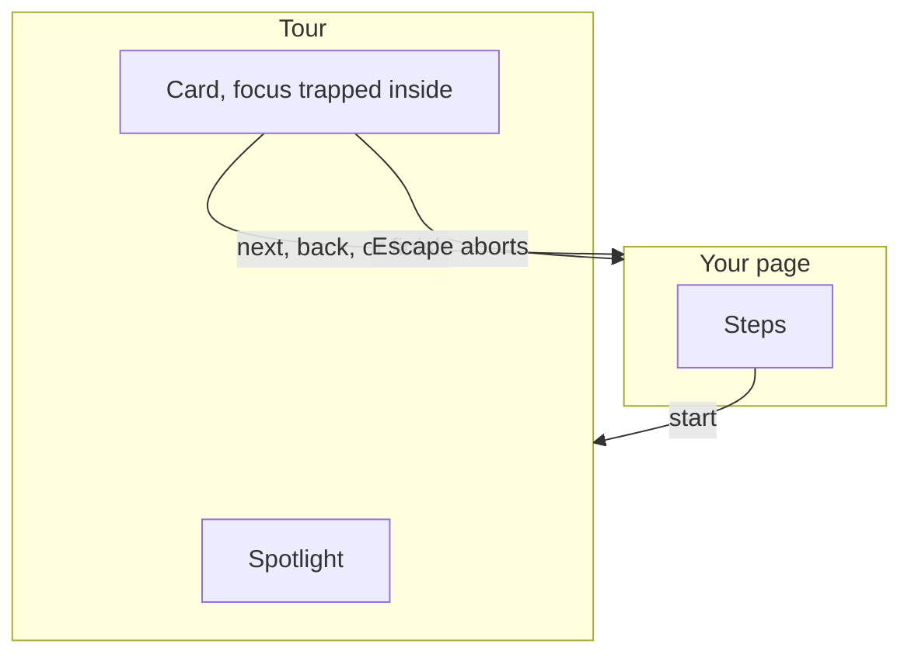
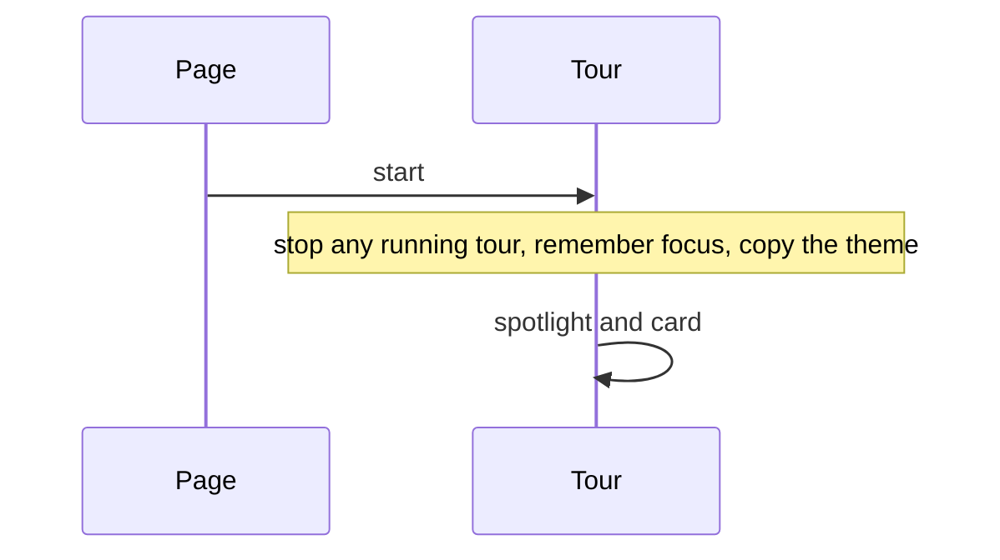
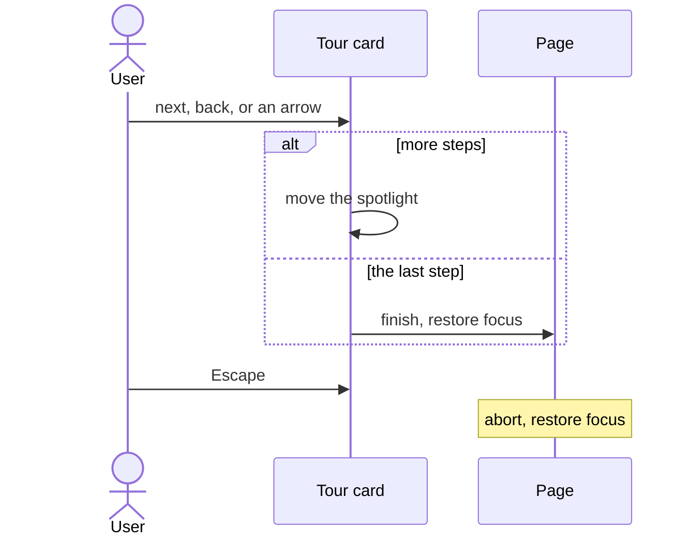
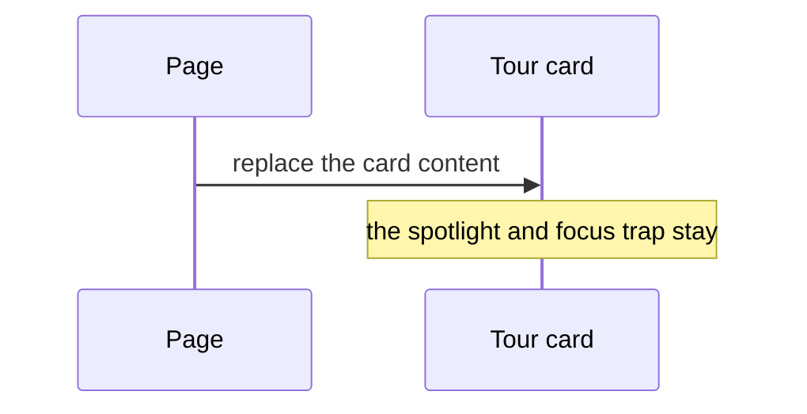

# pixel-tour — design

This page explains **pixel-tour** in plain language. The exact input and output names live in [README.md](./README.md). This page does not copy that table.

**Walk through every flow:** open [orchestration.html](./orchestration.html) in a browser (serve the `src/lib` folder so the shared player script can load).

## 1. What this does, and what it does not

A guided spotlight over the page. start() stops any tour already running, remembers focus, and shows a card in a shared overlay with the current theme. It is not a wizard. Wizards do not start a tour by themselves.

| This piece does | It does not |
| --- | --- |
| Walks the user through anchors on the page | Replace a multi-step form (that is a wizard or pixel-stepper) |
| Traps focus in the tour card | Leave a previous tour running when a new one starts |

## 2. Who talks to whom

A tour is a spotlight and a card. It is not a wizard. Starting a tour stops any tour already running, remembers focus, and copies the theme onto the card. Escape aborts. Focus returns when it ends. Do not start a tour from a wizard step.

**How to read the picture**

- **start replaces a running tour.** It does not stack.
- **The card traps focus.** Arrow keys move between steps when the card allows it.
- **Escape aborts** and focus goes back.
- **Custom card.** The page can replace the card content. The spotlight behavior stays.

## 3. Flows

### Start

1. The page calls start(). Any running tour stops. Focus is snapshotted.
2. The overlay highlights the step target and shows the card. The theme is copied onto the overlay. The card traps focus. The dialog itself is not a full-page modal.

### Next and back

1. Arrow keys or the card buttons move to the next or previous step. The spotlight follows.
2. Escape aborts. Finish also ends the tour. Focus returns to the element that had it before the tour.

### Custom card

1. The page can bring its own card, or use the headless mode and render the step itself.
2. The spotlight and the step order still belong to the tour.

## 4. Step by step

Section 3 is the short list. Each picture here is one of those flows, with the branch that changes what the developer must do. Read the note under the picture before copying the pattern.

### Start

Call start from an explicit user action. A wizard must not call it when a step changes.

### Next and back

Finish and abort both return focus. Do not leave the spotlight up after the last step.

### Custom card

Custom content still lives inside the card. Do not move the spotlight logic into the page.

## 5. States

- Idle.
- Running: spotlight, card, focus trapped in the card.
- Aborted with Escape, or finished on the last step.
- Focus restored to the pre-tour element.

## 6. Easy to get wrong

- A wizard is not a tour. Do not auto-start a tour from a wizard.
- start() replaces the current tour. It does not stack a second one.
- Escape aborts and gives focus back. Do not drop the user on the body.

## 7. Files

- `_pixel-tour-panel-host.scss`
- `pixel-tour-anchor.ts`
- `pixel-tour-card.html`
- `pixel-tour-card.scss`
- `pixel-tour-card.ts`
- `pixel-tour-controls.html`
- `pixel-tour-controls.scss`
- `pixel-tour-controls.ts`
- `pixel-tour-custom-card.html`
- `pixel-tour-custom-card.scss`
- `pixel-tour-custom-card.ts`
- `pixel-tour-panel-body.ts`
- `pixel-tour-panel-controller.ts`
- `pixel-tour-panel-position.ts`
- `pixel-tour-panel-ref-bridge.ts`
- `pixel-tour-panel.providers.ts`
- `pixel-tour-panel.ts`
- `pixel-tour-ref.ts`
- `pixel-tour-spotlight.scss`
- `pixel-tour-spotlight.ts`
- `pixel-tour.service.ts`
- `pixel-tour.types.ts`

The behavior contract stays in [README.md](./README.md). If this page and the README disagree, the README wins. Fix this page.
