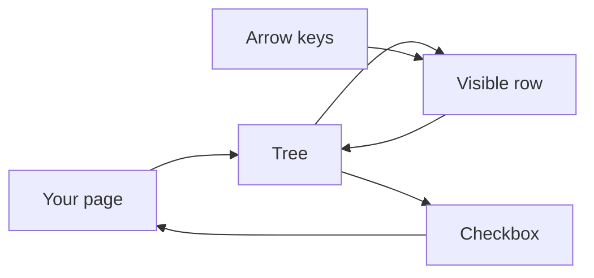
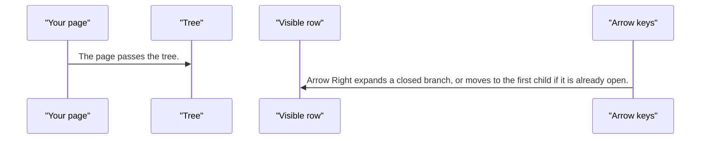
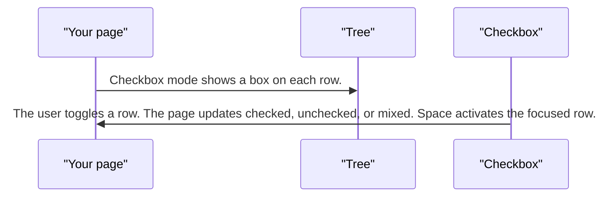

# pixel-tree — design

This page explains **pixel-tree** in plain language. The exact input and output names live in [README.md](./README.md). This page does not copy that table.

**Walk through every flow:** open [orchestration.html](./orchestration.html) in a browser (serve the `src/lib` folder so the shared player script can load).

## 1. What this does, and what it does not

A tree of rows. Only the expanded rows are shown. Arrow Right expands a branch or moves into it. Arrow Left collapses it or jumps to the parent. Checkbox mode can be checked, unchecked, or mixed. Focus is a highlight, not a browser outline.

| This piece does | It does not |
| --- | --- |
| Shows a nested list and expands branches | Render every nested node when its parent is closed |
| Supports a tri-state checkbox | Use a focus ring. The hover surface is the focus cue |

## 2. Who talks to whom

## 3. Flows

### Expand

1. The page passes the tree. Only visible rows are in the list. Closed children are not rendered.
2. Arrow Right expands a closed branch, or moves to the first child if it is already open. Arrow Left collapses, or moves to the parent.

### Checkboxes

1. Checkbox mode shows a box on each row. A parent can be mixed when only some children are checked.
2. The user toggles a row. The page updates checked, unchecked, or mixed. Space activates the focused row.

## 4. Step by step

### Expand

### Checkboxes

## 5. States

- Collapsed or expanded branch.
- Focused row: highlighted, no extra outline.
- Checkbox: checked, unchecked, or mixed.
- Disabled row.

## 6. Easy to get wrong

- Do not render closed children. The tree only lists visible rows.
- Do not add a focus outline. The row highlight is the focus cue.

## 7. Files

- `pixel-tree-drag-preview.ts`
- `pixel-tree-node.directive.ts`
- `pixel-tree.html`
- `pixel-tree.scss`
- `pixel-tree.ts`
- `pixel-tree.types.ts`

The behavior contract stays in [README.md](./README.md). If this page and the README disagree, the README wins. Fix this page.
