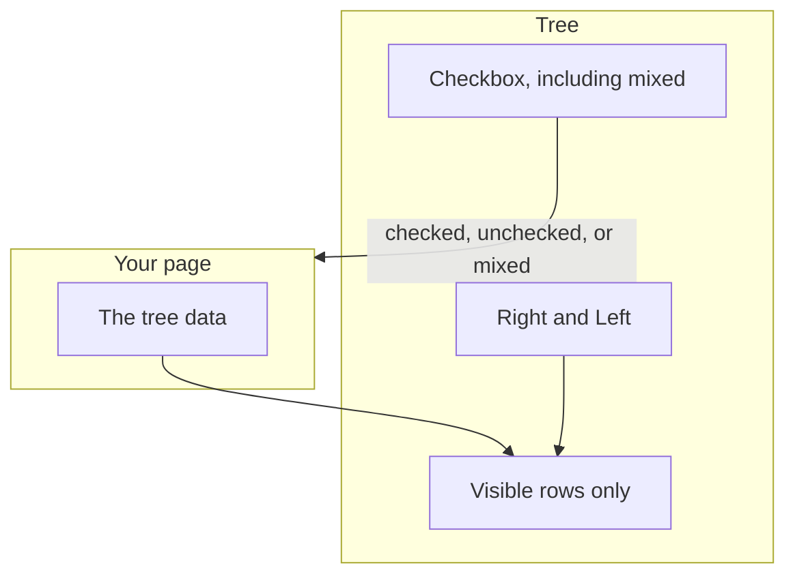
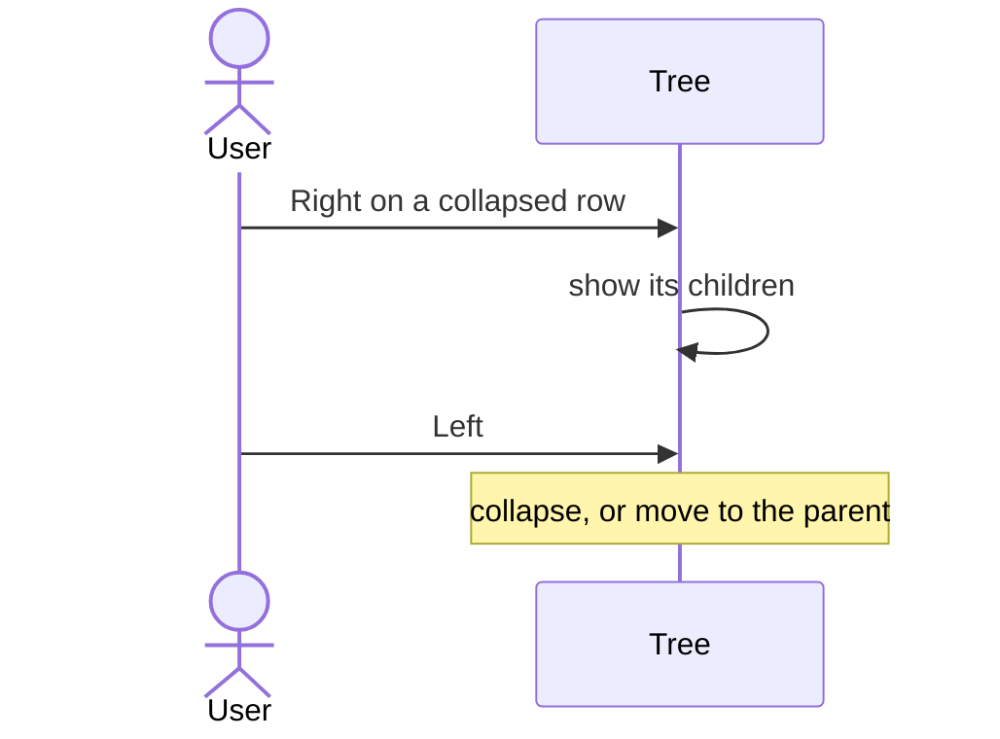
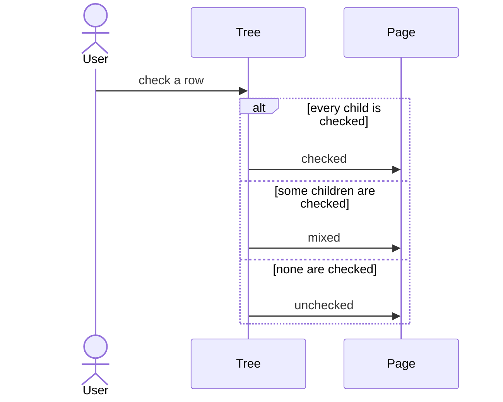

# pixel-tree — design

This page explains **pixel-tree** in plain language. The exact input and output names live in [README.md](./README.md). This page does not copy that table.

**Walk through every flow:** open [orchestration.html](./orchestration.html) in a browser (serve the `src/lib` folder so the shared player script can load).

## 1. What this does, and what it does not

A tree of rows. Only the expanded rows are shown. Arrow Right expands a branch or moves into it. Arrow Left collapses it or jumps to the parent. Checkbox mode can be checked, unchecked, or mixed. Focus is a highlight, not a browser outline.

| This piece does | It does not |
| --- | --- |
| Shows a nested list and expands branches | Render every nested node when its parent is closed |
| Supports a tri-state checkbox | Use a focus ring. The hover surface is the focus cue |

## 2. Who talks to whom

The tree shows only the rows that are currently visible. Right expands a branch or moves into it. Left collapses it or moves to the parent. A checkbox can be mixed when some children are checked. There is no focus ring. Hover is the focus cue.

**How to read the picture**

- **Do not render collapsed children.** Only the open path is in the list.
- **Right** expands or enters. **Left** collapses or goes to the parent.
- **Mixed** means some children are checked. It is a real mixed checkbox, not a third saved value you invent.
- **Focus.** The row does not draw a focus outline. The hover surface is the cue. Keep that, so the tree matches the rest of the library.

## 3. Flows

### Expand

1. The page passes the tree. Only visible rows are in the list. Closed children are not rendered.
2. Arrow Right expands a closed branch, or moves to the first child if it is already open. Arrow Left collapses, or moves to the parent.

### Checkboxes

1. Checkbox mode shows a box on each row. A parent can be mixed when only some children are checked.
2. The user toggles a row. The page updates checked, unchecked, or mixed. Space activates the focused row.

## 4. Step by step

Section 3 is the short list. Each picture here is one of those flows, with the branch that changes what the developer must do. Read the note under the picture before copying the pattern.

### Expand

Arrow keys walk the visible rows. Do not add a second click target that expands without the keyboard path.

### Checkboxes

Bind the checked state from the page if the tree is controlled. Mixed is the partial state, announced as mixed.

## 5. States

- Collapsed or expanded branch.
- Focused row: highlighted, no extra outline.
- Checkbox: checked, unchecked, or mixed.
- Disabled row.

## 6. Easy to get wrong

- Do not render closed children. The tree only lists visible rows.
- Do not add a focus outline. The row highlight is the focus cue.

## 7. Files

- `pixel-tree-drag-preview.ts`
- `pixel-tree-node.directive.ts`
- `pixel-tree.html`
- `pixel-tree.scss`
- `pixel-tree.ts`
- `pixel-tree.types.ts`

The behavior contract stays in [README.md](./README.md). If this page and the README disagree, the README wins. Fix this page.
