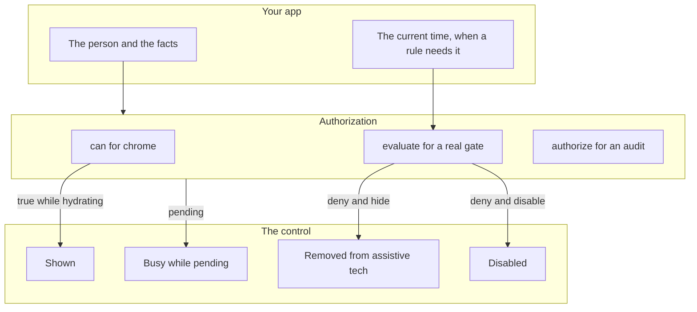
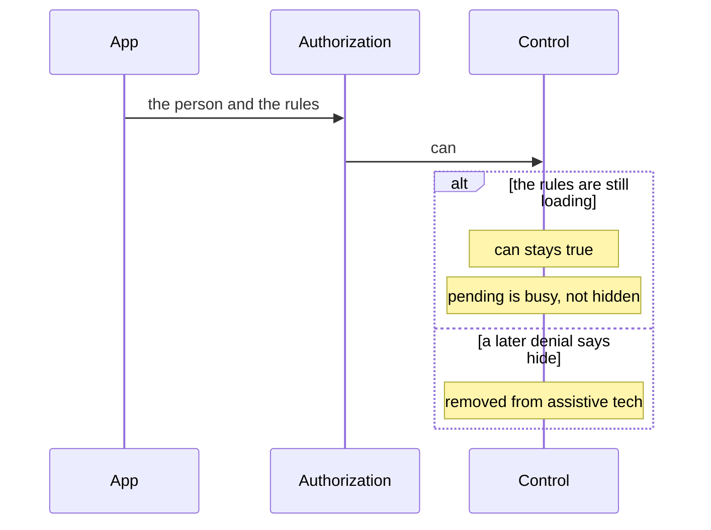
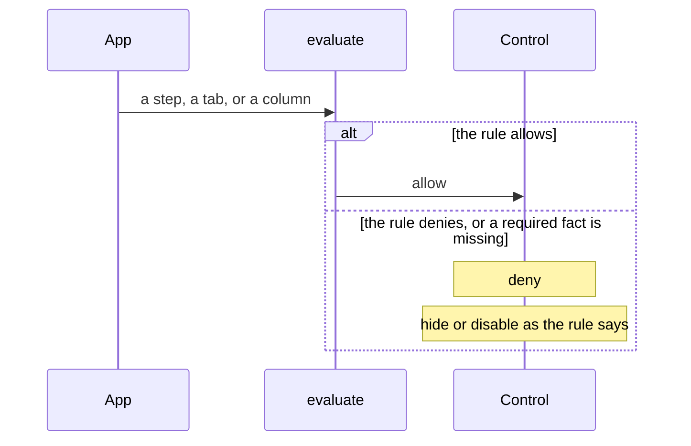
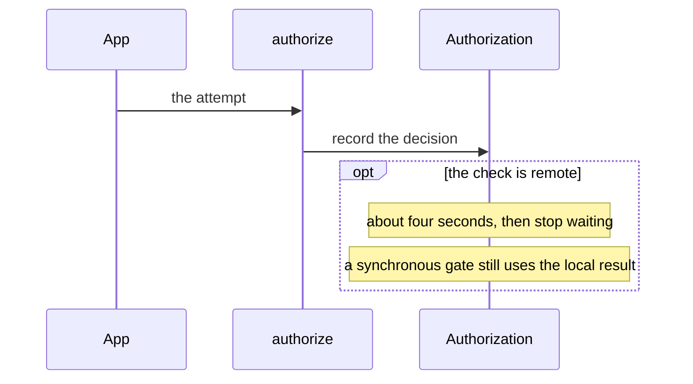
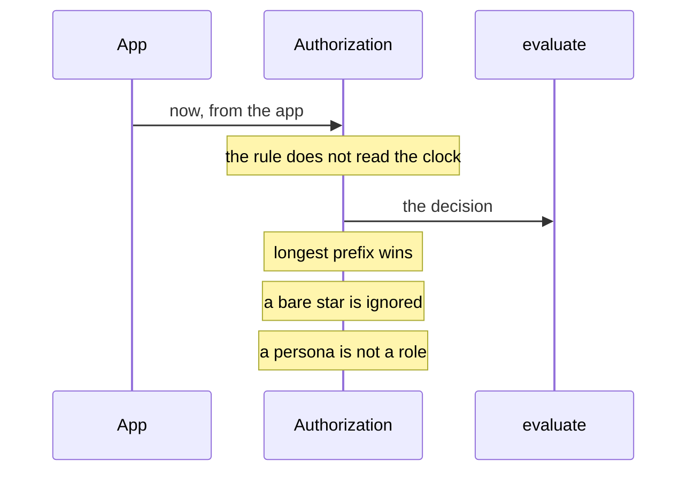

# authorization — design

This page explains **authorization** in plain language. The exact input and output names live in [README.md](./README.md). This page does not copy that table.

**Walk through every flow:** open [orchestration.html](./orchestration.html) in a browser (serve the `src/lib` folder so the shared player script can load).

## 1. What this does, and what it does not

Pixel asks "can this person do this?" and can hide or disable a control. It does not store accounts, roles, or passwords. The app tells Pixel who the person is and what they can do. A persona is a label for a preview, not a role.

| This piece does | It does not |
| --- | --- |
| Checks an action and hides or disables chrome | Be the identity system or the admin console |
| Fails closed when a required fact is missing | Treat "still loading" as a denial. Loading is busy, not hidden |

## 2. Who talks to whom

Pixel is the data plane and the policy enforcement point. It is not the identity system. The app tells Pixel who the person is and which facts the rules need. A persona is a preview label, not a role. can() is for chrome and stays allowed while the rules are still loading. A real gate calls evaluate(). authorize() is the call that writes an audit.

**How to read the picture**

- **can() is chrome.** It stays true while rules are loading so buttons do not flash off. Do not use it to protect a step, a tab, or a column.
- **evaluate() is silent** and safe inside a computed value. Gates call this.
- **authorize() records the decision.** Use it when the attempt itself must be audited.
- **Missing facts fail closed.** If a deny rule needs an attribute and that attribute is absent, the answer is deny.
- **Denied and hide** removes the control from the accessibility tree. Pending is busy, not hidden. Denied and disable uses aria-disabled.
- **Time.** The app passes now. The rule does not call the clock.
- **Wildcards.** The longest prefix wins. A bare star is ignored.
- **Remote checks** time out after about four seconds. A synchronous gate still uses the local result and does not wait on the network.

## 3. Flows

### Show or hide

1. A button asks can(). While the rules are still loading, can() stays true so the chrome does not flash off.
2. A later denial with hide removes the control from the accessibility tree. Pending stays busy, not hidden.

### A real gate

1. A step, a tab, or a column that must be protected calls evaluate(), not can(). This is silent and safe to call from a computed value.
2. Deny disables or hides as the rule says. A missing fact that the rule needs means deny, not allow.

### Audit

1. authorize() is the call that records the decision. Use it when the attempt itself must be audited.
2. Remote checks time out (about four seconds). A synchronous gate still uses the local result and does not wait on the network.

### Time rules

1. If a rule depends on time, the app passes now. The rule does not read the clock itself.
2. Wildcards match the longest prefix. A bare star is ignored. A persona is not a role.

## 4. Step by step

Section 3 is the short list. Each picture here is one of those flows, with the branch that changes what the developer must do. Read the note under the picture before copying the pattern.

### Show or hide

Use can() for buttons and other chrome. A hide denial must leave the accessibility tree. Do not leave a disabled-looking control that is still exposed when the rule said hide.

### A real gate

Do not call can() here. can() is the wrong answer while the rules are loading, and it is the wrong answer when a required fact is missing. evaluate() fails closed.

### Audit

authorize() is the audited call. evaluate() stays quiet so it can run from a computed value. Do not make a synchronous gate wait on the network.

### Time rules

Pass the app’s clock. A test can then freeze time. Do not treat a persona preview label as a permission.

## 5. States

- Hydrating: can() is true, and a pending control is busy.
- Allowed.
- Denied and hidden: removed from assistive tech.
- Denied and disabled: the inner control is aria-disabled.
- Fail closed when a required attribute is missing.

## 6. Easy to get wrong

- Do not use can() as a security gate. It is for chrome and stays true while loading. Gates call evaluate().
- Do not call the clock inside a rule. Pass now from the app.
- A persona is not a role. Do not treat a preview label as permission.
- Denied plus hide must leave the accessibility tree. Pending must not.

## 7. Files

- `authorization.evaluate.ts`
- `authorization.service.ts`
- `authorization.tokens.ts`
- `authorization.types.ts`
- `navigate.adapter.ts`
- `pixel-access.directive.ts`
- `policy.adapter.ts`
- `policy.engine.ts`
- `provide-authorization.ts`
- `public-api.ts`
- `rbac.evaluator.ts`
- `route.helpers.ts`
- `route.watcher.ts`
- `testing.ts`

The behavior contract stays in [README.md](./README.md). If this page and the README disagree, the README wins. Fix this page.
