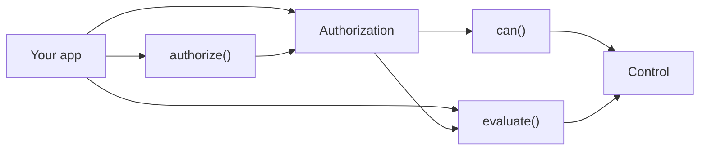
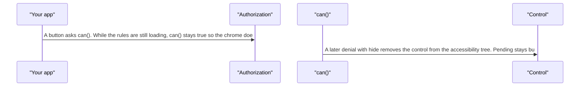
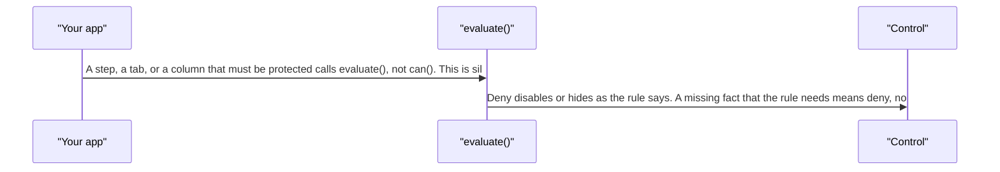
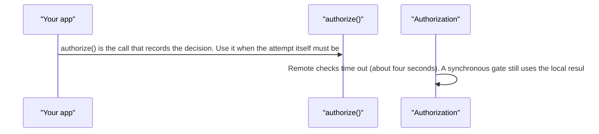
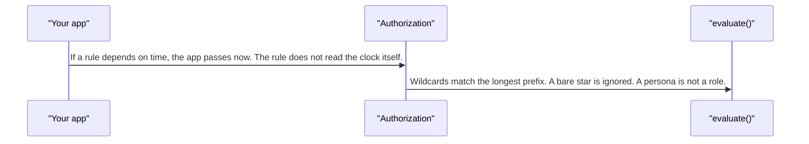

# authorization — design

This page explains **authorization** in plain language. The exact input and output names live in [README.md](./README.md). This page does not copy that table.

**Walk through every flow:** open [orchestration.html](./orchestration.html) in a browser (serve the `src/lib` folder so the shared player script can load).

## 1. What this does, and what it does not

Pixel asks "can this person do this?" and can hide or disable a control. It does not store accounts, roles, or passwords. The app tells Pixel who the person is and what they can do. A persona is a label for a preview, not a role.

| This piece does | It does not |
| --- | --- |
| Checks an action and hides or disables chrome | Be the identity system or the admin console |
| Fails closed when a required fact is missing | Treat "still loading" as a denial. Loading is busy, not hidden |

## 2. Who talks to whom

## 3. Flows

### Show or hide

1. A button asks can(). While the rules are still loading, can() stays true so the chrome does not flash off.
2. A later denial with hide removes the control from the accessibility tree. Pending stays busy, not hidden.

### A real gate

1. A step, a tab, or a column that must be protected calls evaluate(), not can(). This is silent and safe to call from a computed value.
2. Deny disables or hides as the rule says. A missing fact that the rule needs means deny, not allow.

### Audit

1. authorize() is the call that records the decision. Use it when the attempt itself must be audited.
2. Remote checks time out (about four seconds). A synchronous gate still uses the local result and does not wait on the network.

### Time rules

1. If a rule depends on time, the app passes now. The rule does not read the clock itself.
2. Wildcards match the longest prefix. A bare star is ignored. A persona is not a role.

## 4. Step by step

### Show or hide

### A real gate

### Audit

### Time rules

## 5. States

- Hydrating: can() is true, and a pending control is busy.
- Allowed.
- Denied and hidden: removed from assistive tech.
- Denied and disabled: the inner control is aria-disabled.
- Fail closed when a required attribute is missing.

## 6. Easy to get wrong

- Do not use can() as a security gate. It is for chrome and stays true while loading. Gates call evaluate().
- Do not call the clock inside a rule. Pass now from the app.
- A persona is not a role. Do not treat a preview label as permission.
- Denied plus hide must leave the accessibility tree. Pending must not.

## 7. Files

- `authorization.evaluate.ts`
- `authorization.service.ts`
- `authorization.tokens.ts`
- `authorization.types.ts`
- `navigate.adapter.ts`
- `pixel-access.directive.ts`
- `policy.adapter.ts`
- `policy.engine.ts`
- `provide-authorization.ts`
- `public-api.ts`
- `rbac.evaluator.ts`
- `route.helpers.ts`
- `route.watcher.ts`
- `testing.ts`

The behavior contract stays in [README.md](./README.md). If this page and the README disagree, the README wins. Fix this page.
