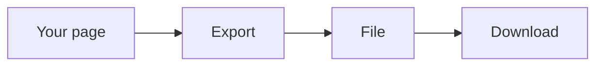
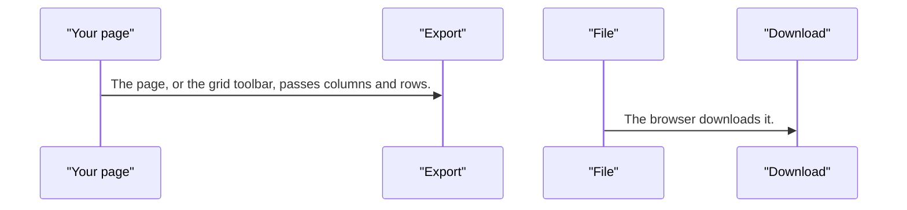
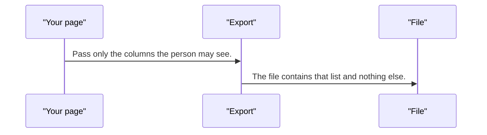

# export — design

This page explains **export** in plain language. The exact input and output names live in [README.md](./README.md). This page does not copy that table.

**Walk through every flow:** open [orchestration.html](./orchestration.html) in a browser (serve the `src/lib` folder so the shared player script can load).

## 1. What this does, and what it does not

Builds a CSV, TSV, JSON, or spreadsheet file in memory and downloads it. It does not call the network. The data grid toolbar uses it. It does not read the DOM.

| This piece does | It does not |
| --- | --- |
| Turns rows into a file and saves it | Upload or download from a URL (use file-transfer) |
| Stays in memory | Scrape a table from the page |

## 2. Who talks to whom

## 3. Flows

### Download rows

1. The page, or the grid toolbar, passes columns and rows. The service builds the file in memory.
2. The browser downloads it. No request is sent.

### Only allowed columns

1. Pass only the columns the person may see. The service does not discover hidden columns from the DOM.
2. The file contains that list and nothing else.

## 4. Step by step

### Download rows

### Only allowed columns

## 5. States

- Idle.
- Building the file.
- Download started.

## 6. Easy to get wrong

- This is not an HTTP client and not the file-transfer queue.
- Do not pass columns the user must not see. Filter them before the call.

## 7. Files

- `clipboard.ts`
- `export.service.ts`
- `export.tokens.ts`
- `export.ts`
- `export.types.ts`
- `public-api.ts`
- `save-as.ts`
- `serialize.ts`
- `xlsx.ts`
- `zip.ts`

The behavior contract stays in [README.md](./README.md). If this page and the README disagree, the README wins. Fix this page.
