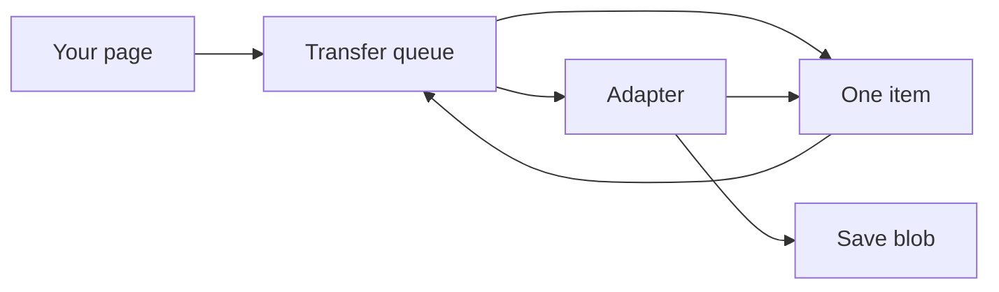
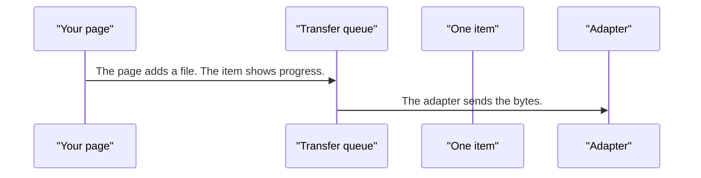
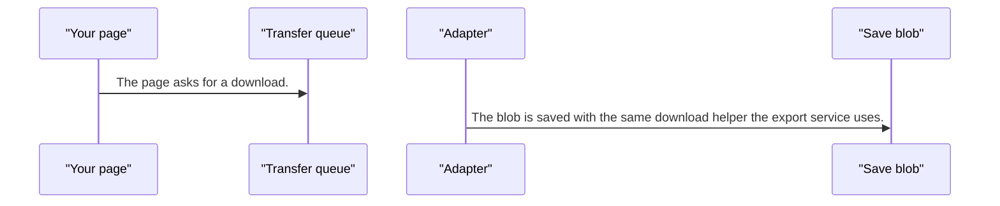
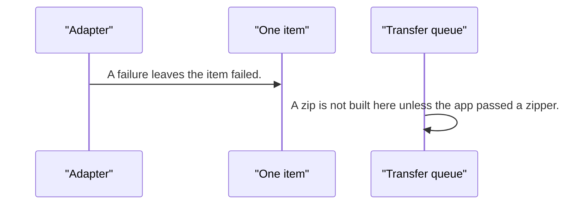

# file-transfer — design

This page explains **file-transfer** in plain language. The exact input and output names live in [README.md](./README.md). This page does not copy that table.

**Walk through every flow:** open [orchestration.html](./orchestration.html) in a browser (serve the `src/lib` folder so the shared player script can load).

## 1. What this does, and what it does not

A queue of uploads and downloads. Each item can pause, resume, retry, or cancel. Adapters do the real bytes. Saving a blob reuses the export download helper. A zip needs a zipper the app provides. This is not a table export.

| This piece does | It does not |
| --- | --- |
| Queues uploads and downloads with pause and retry | Build a CSV from rows (use export) |
| Talks to adapters for the real transfer | Zip files unless the app supplies a zipper |

## 2. Who talks to whom

## 3. Flows

### Upload

1. The page adds a file. The item shows progress.
2. The adapter sends the bytes. The page can pause, resume, retry, or cancel.

### Download

1. The page asks for a download. The adapter fetches it.
2. The blob is saved with the same download helper the export service uses.

### Retry or cancel

1. A failure leaves the item failed. Retry runs it again. Cancel removes it from the active queue.
2. A zip is not built here unless the app passed a zipper.

## 4. Step by step

### Upload

### Download

### Retry or cancel

## 5. States

- Queued, running, paused, failed, cancelled, and complete.
- Progress on the item.

## 6. Easy to get wrong

- Do not use this to export a grid. That is the export service.
- Do not expect zip support until the app provides a zipper.

## 7. Files

- `adapters`
- `download.service.ts`
- `file-transfer.service.ts`
- `file-transfer.store.ts`
- `file-transfer.tokens.ts`
- `file-transfer.types.ts`
- `offline-queue.service.ts`
- `public-api.ts`
- `upload.service.ts`
- `utils`

The behavior contract stays in [README.md](./README.md). If this page and the README disagree, the README wins. Fix this page.
