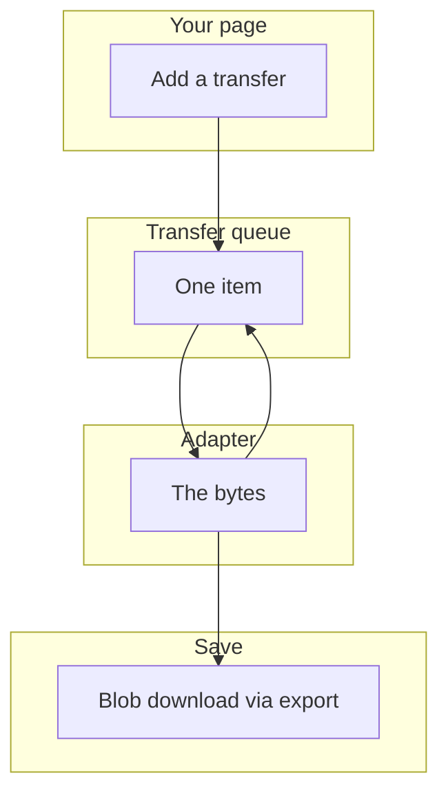
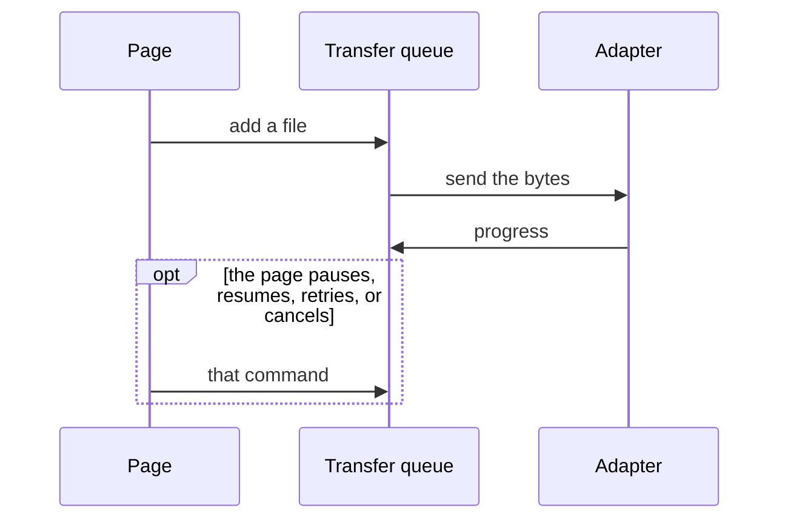
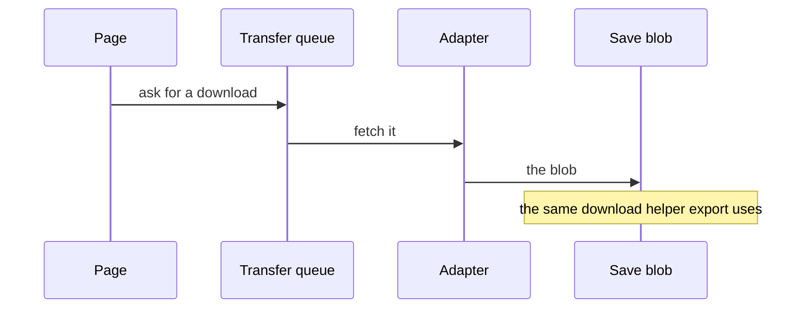
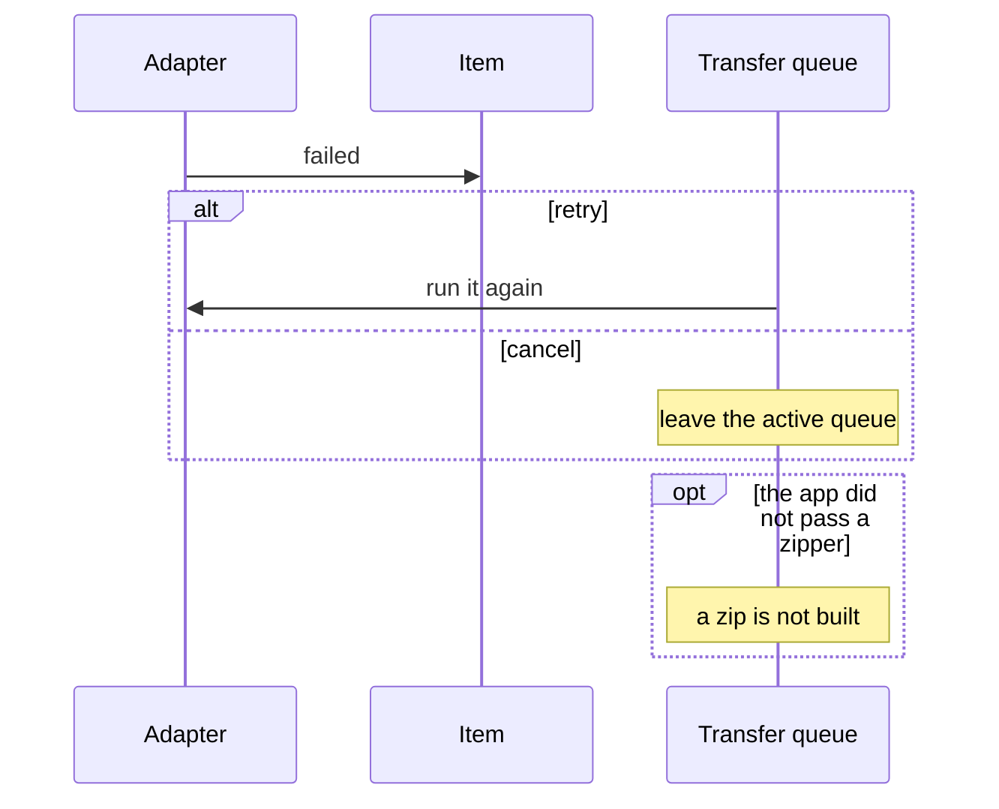

# file-transfer — design

This page explains **file-transfer** in plain language. The exact input and output names live in [README.md](./README.md). This page does not copy that table.

**Walk through every flow:** open [orchestration.html](./orchestration.html) in a browser (serve the `src/lib` folder so the shared player script can load).

## 1. What this does, and what it does not

A queue of uploads and downloads. Each item can pause, resume, retry, or cancel. Adapters do the real bytes. Saving a blob reuses the export download helper. A zip needs a zipper the app provides. This is not a table export.

| This piece does | It does not |
| --- | --- |
| Queues uploads and downloads with pause and retry | Build a CSV from rows (use export) |
| Talks to adapters for the real transfer | Zip files unless the app supplies a zipper |

## 2. Who talks to whom

File transfer is a queue. The page adds an upload or a download. An adapter moves the bytes. Each item can pause, resume, retry, or cancel. Saving a finished blob reuses the export download helper. A zip is built only when the app supplies a zipper. This queue is not a table export.

**How to read the picture**

- **The adapter does the network.** The queue tracks progress and the commands.
- **Pause, resume, retry, and cancel** act on one item.
- **A failed item stays failed** until retry or cancel.
- **Zip** needs a zipper from the app. The service does not include one.
- **Grid export** is the export service, not this queue.

## 3. Flows

### Upload

1. The page adds a file. The item shows progress.
2. The adapter sends the bytes. The page can pause, resume, retry, or cancel.

### Download

1. The page asks for a download. The adapter fetches it.
2. The blob is saved with the same download helper the export service uses.

### Retry or cancel

1. A failure leaves the item failed. Retry runs it again. Cancel removes it from the active queue.
2. A zip is not built here unless the app passed a zipper.

## 4. Step by step

Section 3 is the short list. Each picture here is one of those flows, with the branch that changes what the developer must do. Read the note under the picture before copying the pattern.

### Upload

Show progress from the item. Do not start a second upload beside the queue for the same file.

### Download

The download helper only saves the blob. It does not build a CSV. If you have rows, use export.

### Retry or cancel

Cancel is not retry. A zip of several files waits until the app provides a zipper.

## 5. States

- Queued, running, paused, failed, cancelled, and complete.
- Progress on the item.

## 6. Easy to get wrong

- Do not use this to export a grid. That is the export service.
- Do not expect zip support until the app provides a zipper.

## 7. Files

- `adapters`
- `download.service.ts`
- `file-transfer.service.ts`
- `file-transfer.store.ts`
- `file-transfer.tokens.ts`
- `file-transfer.types.ts`
- `offline-queue.service.ts`
- `public-api.ts`
- `upload.service.ts`
- `utils`

The behavior contract stays in [README.md](./README.md). If this page and the README disagree, the README wins. Fix this page.
