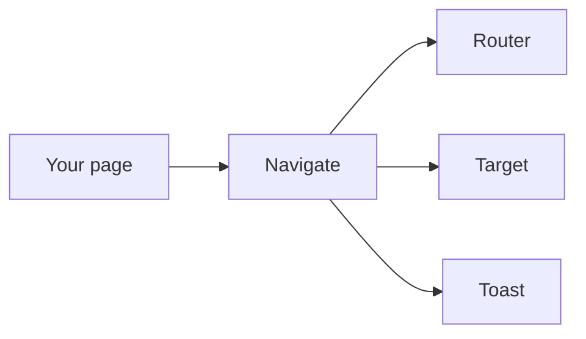
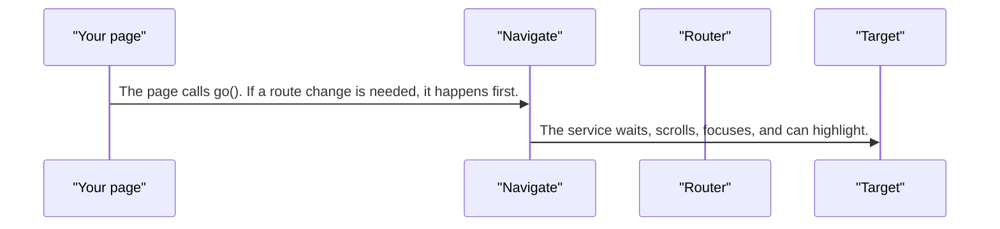
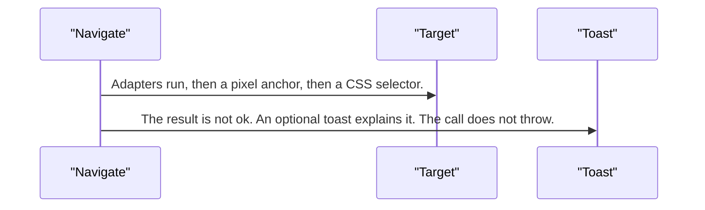
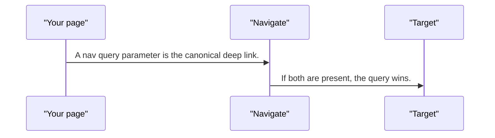

# navigate — design

This page explains **navigate** in plain language. The exact input and output names live in [README.md](./README.md). This page does not copy that table.

**Walk through every flow:** open [orchestration.html](./orchestration.html) in a browser (serve the `src/lib` folder so the shared player script can load).

## 1. What this does, and what it does not

Sends the user to a place in the app: optional route change, then wait, scroll, focus, and highlight. It is not a second router and not a tour. A missing target fails softly. It does not throw. The canonical link is a query parameter. A hash is only for a simple section, and the query wins when both exist.

| This piece does | It does not |
| --- | --- |
| Routes, scrolls, focuses, and highlights a target | Replace the Angular router |
| Fails softly when the target is missing | Open a wizard by itself |

## 2. Who talks to whom

## 3. Flows

### Go to a target

1. The page calls go(). If a route change is needed, it happens first.
2. The service waits, scrolls, focuses, and can highlight. The sticky offset defaults to the toolbar height. Highlight respects reduced motion.

### Target missing

1. Adapters run, then a pixel anchor, then a CSS selector. Nothing matches.
2. The result is not ok. An optional toast explains it. The call does not throw.

### Which link wins

1. A nav query parameter is the canonical deep link. A hash is only for a simple section.
2. If both are present, the query wins. An unregistered wizard adapter reports adapter-missing. Wizards do not open by themselves.

## 4. Step by step

### Go to a target

### Target missing

### Which link wins

## 5. States

- Idle.
- Routing, waiting, scrolling, focusing, highlighting.
- Success.
- Soft failure: not ok, optional toast, no throw.

## 6. Easy to get wrong

- Do not use this as a tour. Tours have their own controller.
- Do not throw when the element is missing. Handle the soft failure.
- Do not auto-open a wizard from a deep link unless a wizard adapter is actually registered.

## 7. Files

- `navigate-anchor.ts`
- `navigate-dom.ts`
- `navigate-url.ts`
- `navigate.service.ts`
- `navigate.tokens.ts`
- `navigate.types.ts`
- `notification-nav.ts`
- `public-api.ts`

The behavior contract stays in [README.md](./README.md). If this page and the README disagree, the README wins. Fix this page.
