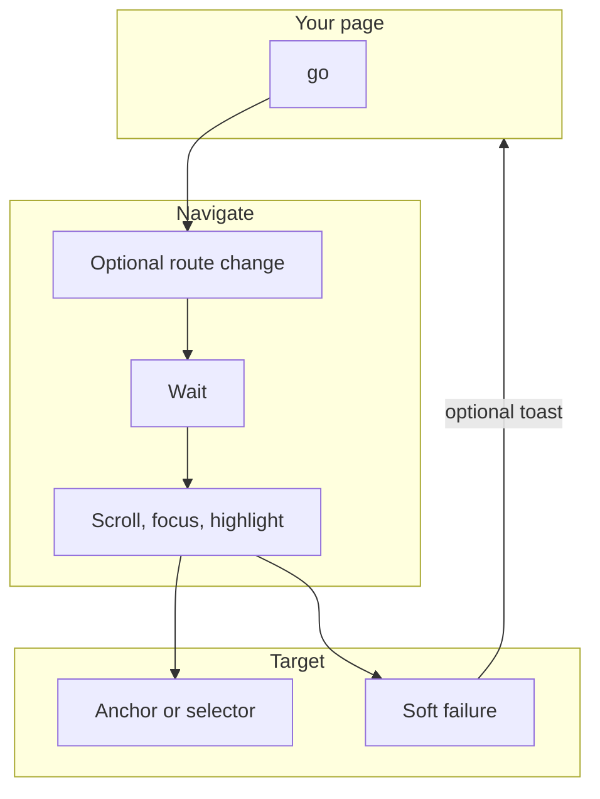
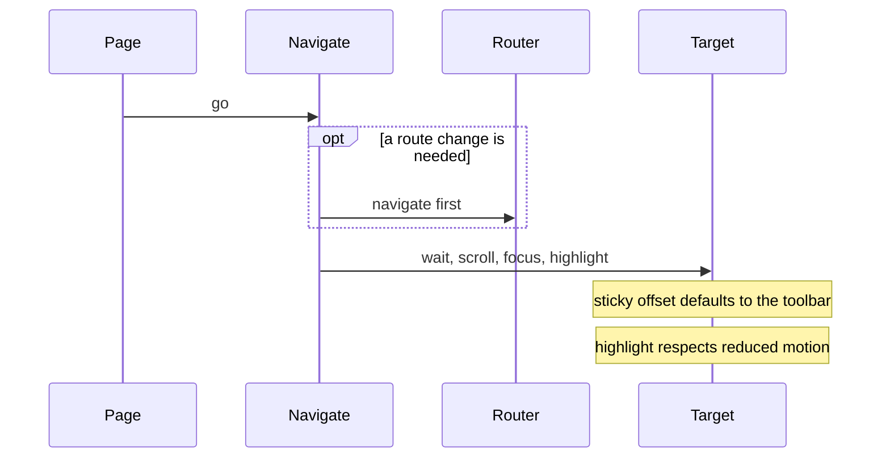
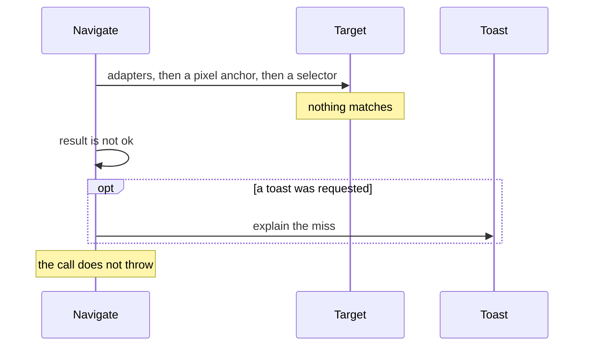
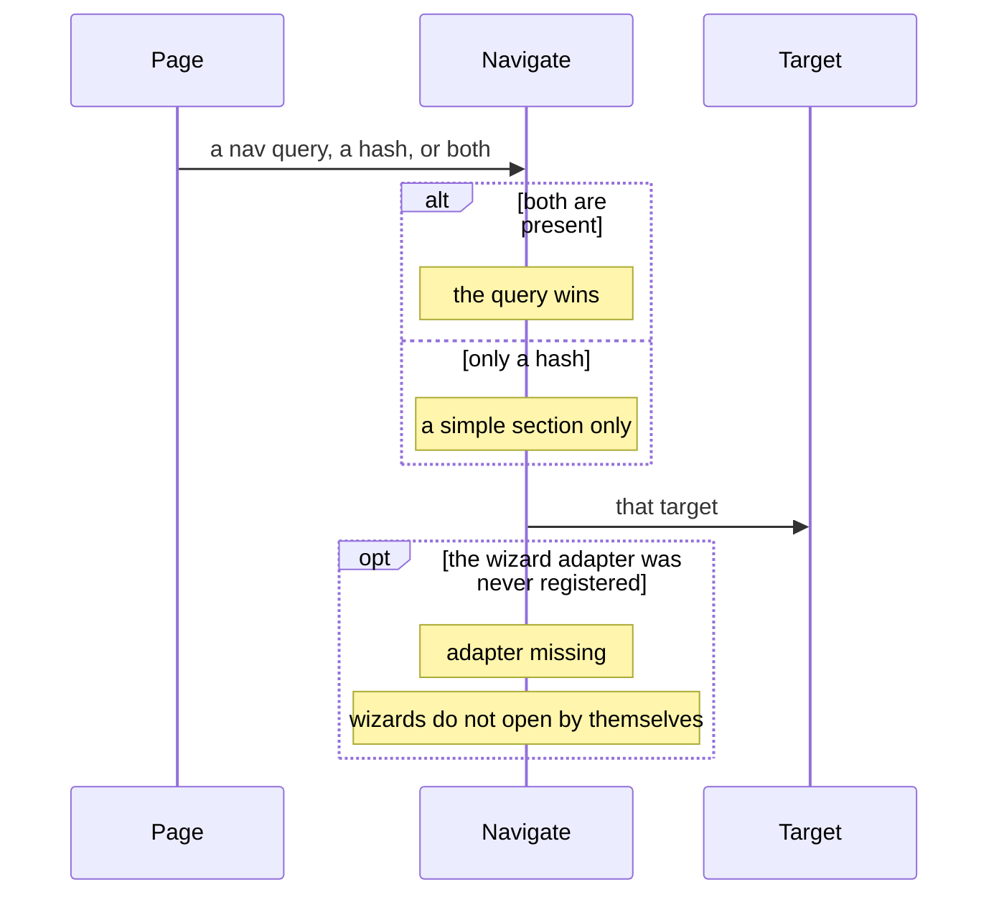

# navigate — design

This page explains **navigate** in plain language. The exact input and output names live in [README.md](./README.md). This page does not copy that table.

**Walk through every flow:** open [orchestration.html](./orchestration.html) in a browser (serve the `src/lib` folder so the shared player script can load).

## 1. What this does, and what it does not

Sends the user to a place in the app: optional route change, then wait, scroll, focus, and highlight. It is not a second router and not a tour. A missing target fails softly. It does not throw. The canonical link is a query parameter. A hash is only for a simple section, and the query wins when both exist.

| This piece does | It does not |
| --- | --- |
| Routes, scrolls, focuses, and highlights a target | Replace the Angular router |
| Fails softly when the target is missing | Open a wizard by itself |

## 2. Who talks to whom

Navigate moves the user to a place in the app. It can change the route, then wait, scroll, focus, and highlight. It is not a second router, and it is not a tour. A missing target is a soft failure: the result is not ok, an optional toast can explain it, and the call does not throw.

**How to read the picture**

- **Order.** Optional route, then wait, then scroll, focus, and highlight.
- **Sticky offset** defaults to the toolbar height so the target is not hidden under the header.
- **Highlight** respects reduced motion.
- **Lookup.** Adapters, then a pixel anchor, then a CSS selector.
- **Links.** The canonical deep link is the nav query. A hash is only for a simple section. If both exist, the query wins.
- **Wizards** do not open by themselves. An unregistered wizard adapter reports that the adapter is missing.

## 3. Flows

### Go to a target

1. The page calls go(). If a route change is needed, it happens first.
2. The service waits, scrolls, focuses, and can highlight. The sticky offset defaults to the toolbar height. Highlight respects reduced motion.

### Target missing

1. Adapters run, then a pixel anchor, then a CSS selector. Nothing matches.
2. The result is not ok. An optional toast explains it. The call does not throw.

### Which link wins

1. A nav query parameter is the canonical deep link. A hash is only for a simple section.
2. If both are present, the query wins. An unregistered wizard adapter reports adapter-missing. Wizards do not open by themselves.

## 4. Step by step

Section 3 is the short list. Each picture here is one of those flows, with the branch that changes what the developer must do. Read the note under the picture before copying the pattern.

### Go to a target

Use this when a link must land on a control, not only on a route. Do not also start a tour for the same landing.

### Target missing

Handle the soft failure. Do not wrap go() in a try/catch expecting an exception.

### Which link wins

Register a wizard adapter before a deep link should open that wizard. Otherwise the result is adapter-missing, not an opened wizard.

## 5. States

- Idle.
- Routing, waiting, scrolling, focusing, highlighting.
- Success.
- Soft failure: not ok, optional toast, no throw.

## 6. Easy to get wrong

- Do not use this as a tour. Tours have their own controller.
- Do not throw when the element is missing. Handle the soft failure.
- Do not auto-open a wizard from a deep link unless a wizard adapter is actually registered.

## 7. Files

- `navigate-anchor.ts`
- `navigate-dom.ts`
- `navigate-url.ts`
- `navigate.service.ts`
- `navigate.tokens.ts`
- `navigate.types.ts`
- `notification-nav.ts`
- `public-api.ts`

The behavior contract stays in [README.md](./README.md). If this page and the README disagree, the README wins. Fix this page.
