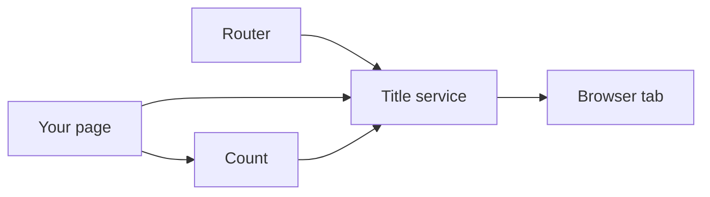

# title — design

This page explains **title** in plain language. The exact input and output names live in [README.md](./README.md). This page does not copy that table.

**Walk through every flow:** open [orchestration.html](./orchestration.html) in a browser (serve the `src/lib` folder so the shared player script can load).

## 1. What this does, and what it does not

The one writer of the browser tab title. Turn on router sync and do not also leave the default title strategy subscribed. The title is the deepest page title on the primary route, not a chain of parent titles. Counts in the title wait about a second, and a page change flushes them.

| This piece does | It does not |
| --- | --- |
| Sets the document title from the route or an explicit call | Build "child · parent · brand" chains |
| Can show a count, debounced | Announce the title in a live region as well |

## 2. Who talks to whom



## 3. Flows

### Route title

1. Router sync is on. A navigation writes the leaf title of the primary route.
2. Do not also subscribe the default title strategy. Two writers will fight.

### Explicit title

1. The page sets a title, or an error title, on purpose.
2. Do not rebuild the title from the trail on every navigation if router sync is already on.

### Unread count

1. A count at or below zero is omitted. A positive count waits about a second so it does not flicker.
2. A page change flushes the count immediately into the new title. Do not also put the title in a live region.

## 4. Step by step

### Route title

```mermaid
sequenceDiagram
  participant router as "Router"
  participant title as "Title service"
  participant doc as "Browser tab"
  router->>title: Router sync is on. A navigation writes the leaf title of the primary route.
  title->>title: Do not also subscribe the default title strategy.
```

### Explicit title

```mermaid
sequenceDiagram
  participant page as "Your page"
  participant title as "Title service"
  participant doc as "Browser tab"
  page->>title: The page sets a title, or an error title, on purpose.
  page->>page: Do not rebuild the title from the trail on every navigation if router sync is already on.
```

### Unread count

```mermaid
sequenceDiagram
  participant page as "Your page"
  participant count as "Count"
  participant title as "Title service"
  participant router as "Router"
  participant doc as "Browser tab"
  page->>count: A count at or below zero is omitted.
  router->>title: A page change flushes the count immediately into the new title.
```

## 5. States

- Following the leaf route title.
- Explicit title or error title.
- Count pending, then flushed.

## 6. Easy to get wrong

- One writer only. Router sync on means the default strategy stays off.
- Do not concatenate parent titles.
- Do not announce the document title in a live region.
- Call the error title on error pages instead of leaving the previous page’s title.

## 7. Files

- `public-api.ts`
- `title.config.ts`
- `title.format.ts`
- `title.provide.ts`
- `title.service.ts`
- `title.strategy.ts`

The behavior contract stays in [README.md](./README.md). If this page and the README disagree, the README wins. Fix this page.
