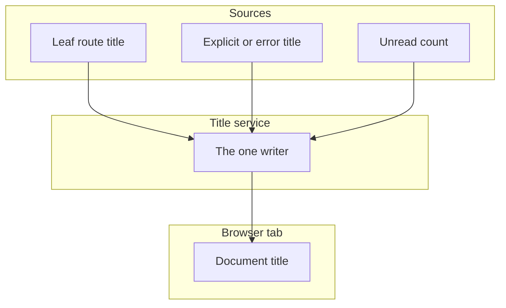

# title — design

This page explains **title** in plain language. The exact input and output names live in [README.md](./README.md). This page does not copy that table.

**Walk through every flow:** open [orchestration.html](./orchestration.html) in a browser (serve the `src/lib` folder so the shared player script can load).

## 1. What this does, and what it does not

The one writer of the browser tab title. Turn on router sync and do not also leave the default title strategy subscribed. The title is the deepest page title on the primary route, not a chain of parent titles. Counts in the title wait about a second, and a page change flushes them.

| This piece does | It does not |
| --- | --- |
| Sets the document title from the route or an explicit call | Build "child · parent · brand" chains |
| Can show a count, debounced | Announce the title in a live region as well |

## 2. Who talks to whom

One service writes the browser tab title. Turn on router sync and do not also leave the default title strategy subscribed. The title is the leaf title of the primary route, not a chain of parent titles. An explicit title or an error title is a deliberate override. A count waits about a second, and a page change flushes it.



**How to read the picture**

- **One writer.** Router sync on means the default strategy stays off.
- **Leaf only.** Do not build “child · parent · brand”.
- **fromTrail()** is the explicit path when you really want a trail. Do not also run router sync on top of it.
- **Count.** Zero or below is omitted. A positive count waits about a second so it does not flicker. A page change flushes immediately.
- **Do not announce the title** in a live region. The tab title is not a status message.
- **Error pages** should set an error title. Otherwise the previous page’s title stays.

## 3. Flows

### Route title

1. Router sync is on. A navigation writes the leaf title of the primary route.
2. Do not also subscribe the default title strategy. Two writers will fight.

### Explicit title

1. The page sets a title, or an error title, on purpose.
2. Do not rebuild the title from the trail on every navigation if router sync is already on.

### Unread count

1. A count at or below zero is omitted. A positive count waits about a second so it does not flicker.
2. A page change flushes the count immediately into the new title. Do not also put the title in a live region.

## 4. Step by step

Section 3 is the short list. Each picture here is one of those flows, with the branch that changes what the developer must do. Read the note under the picture before copying the pattern.

### Route title

```mermaid
sequenceDiagram
  participant Router
  participant Title as Title service
  participant Tab as Browser tab
  Router->>Title: the leaf title of the primary route
  Title->>Tab: write it
  Note over Title: the default strategy is not also subscribed
```

Two writers will overwrite each other. Pick router sync and leave the default strategy off.

### Explicit title

```mermaid
sequenceDiagram
  participant Page
  participant Title as Title service
  participant Tab as Browser tab
  Page->>Title: a title, or an error title
  Title->>Tab: write it
  Note over Page: do not also rebuild a parent chain
```

Use an explicit title when the route title is wrong for this moment, including error pages. Do not concatenate parent titles on every navigation if router sync is already on.

### Unread count

```mermaid
sequenceDiagram
  participant Page
  participant Title as Title service
  participant Tab as Browser tab
  Page->>Title: a count
  alt the count is zero or below
    Note over Title: omit it
  else the count is positive
    Note over Title: wait about a second
    Title->>Tab: then include it
  end
  opt the route changes
    Title->>Tab: flush the count into the new title now
  end
  Note over Tab: do not also announce the title
```

The debounce avoids flicker while a count chatters. A navigation should not wait that second. Flush on the page change.

## 5. States

- Following the leaf route title.
- Explicit title or error title.
- Count pending, then flushed.

## 6. Easy to get wrong

- One writer only. Router sync on means the default strategy stays off.
- Do not concatenate parent titles.
- Do not announce the document title in a live region.
- Call the error title on error pages instead of leaving the previous page’s title.

## 7. Files

- `public-api.ts`
- `title.config.ts`
- `title.format.ts`
- `title.provide.ts`
- `title.service.ts`
- `title.strategy.ts`

The behavior contract stays in [README.md](./README.md). If this page and the README disagree, the README wins. Fix this page.
